# CVE-2018-17369

1. [Contents](#Contents)
    - [Exploit Directory](#exploit-directory)
    - [VulnerableFramework Directory](#vulnerableframework-directory)
2. [The CVE](#the-cve)
    - [Details](#details)
    - [Root Cause of the Vulnerability](#root-cause-of-the-vulnerability)
    - [Potential Attack Scenario](#potential-attack-scenario)
3. [The Vulnerable Framework](#the-vulnerable-framework)
    - [Description](#description)
    - [Build Instructions](#build-instructions)
    - [Deployment Instructions](#deployment-instructions)
    - [Static Analysis Results](#static-analysis-results)
        - [Spotbugs](#spotbugs)
        - [SonarQube](#sonarqube)
        - [Security Hotspots Analysis](#security-hotspots-analysis)
4. [Exploitation of the Vulnerability](#exploitation-of-the-vulnerability)
    - [Running the Framework](#running-the-framework)
    - [Exploit the Framework](#exploit-the-framework)
    - [Analysis of the Exploitation Outcome](#analysis-of-the-exploitation-outcome)
5. [Possible Security Patch](#possible-security-patch)

## **Contents**
### **Exploit Directory**
This directory contains a single **python script** named **exploit.py** that will be used to trigger a specific vulnerability found in the application. Furthermore it is also present a **README.md** file that shows how to execute the python script.

### **VulnerableFramework Directory**
**VulnerableFramework** directory contains three different subdirectories:

- **Docker**: contains a collection of scripts and configuration files that will be used to properly run the vulnerable framework in a dockerized enviroment.

- **spring-boot-authority**: contains the **spring-boot-authority** projects sources from which the framework can be built.

- **jar**: contains a jar file of the application.

Additional information about the **Docker** directory contents as well as information on how to deploy the framework, can be obtained by reading the **README.md** file within this same folder.

## **The CVE**
### **Details**
In this section a detailed description of **CVE-2018-17369** will be provided, the following is a first description provided by the NIST:

> An issue was discovered in springboot_authority through 2017-03-06. There is stored XSS via the admin/role/edit roleKey, name, or description parameter.

This CVE refers to an open source project called [Spring-Boot-Authority](https://github.com/qzw1210/springboot_authority) that contains multiple **Stored XSS** vulnerabilities that were flagged in a Github [issue](https://github.com/qzw1210/springboot_authority/issues/4) by a project contributor.

### **Root Cause of the Vulnerability**
The root cause of the multiple Stored XSS vulnerabilities is that when a **User**, **Role** or **Resource** is created or edited, there is no sanitization of any of the parameters provided by the user. When these inputs get inserted into the DOM of the page they may trigger a code injection vulnerability if crafted in a specific way.

In the two following screenshots it is possible to notice how the parameters of a new user are directly mapped to a **User** object (UserController), and how **User** object fields are immediately updated in the Database (UserService) with no input sanitization of any kind.

**UserController.java**
 

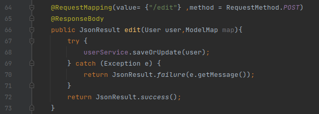

 

**UserService.java**
 

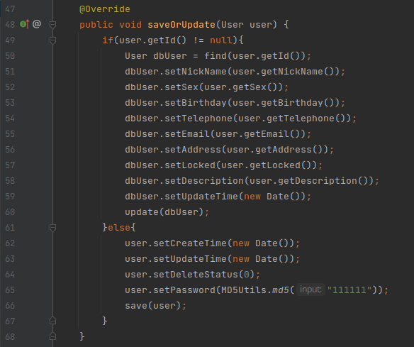

 

### **Potential Attack Scenario**
As a potential attack scenario we could think about the situation in which a **Spring Boot** application is using this framework for **user, resources and roles management**.

In order for the attack to be feasible there is only one requirement: the attacker must be authenticated to the backend management system and able to create or edit new users, resources or roles

## **The Vulnerable Framework**
### **Description**
[CVE-2018-17368](https://nvd.nist.gov/vuln/detail/CVE-2018-17369) was specifically issued for the framework I've decided to analyze in this report. The project is named [SpringBoot_Authority](https://github.com/qzw1210/springboot_authority): an open source **Background Management System** used for managing **Users**, **Resources** and **Roles**.

 

After having [deployed the framework](#deployment-instructions), the following login page can be retrieved at the URL **http://localhost:8080/admin/login**.

 

**Login Page**

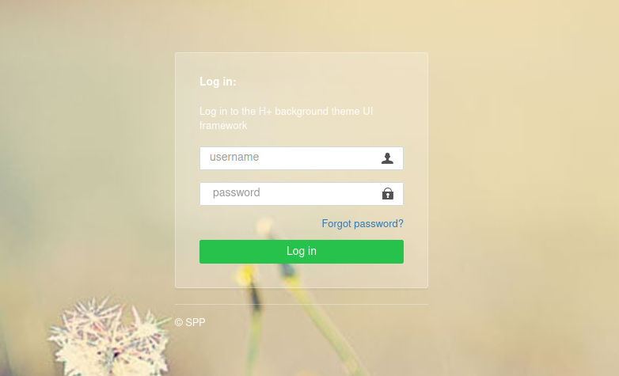

 

By using as username "**admin**" and as password "**111111**", you will be redirected to the homepage shown here below:

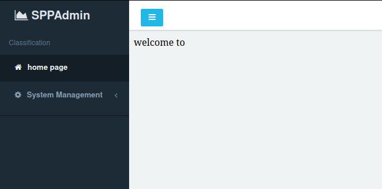

  

To access the various menus just **expand System Management** option inside the **left sidebar**, and select one among **User Management**, **Role Management** or **Resource Management**

 

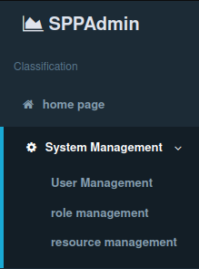

  

Depending on the previous selection you will end up in one of the three management pages, the image below shows the **Resource Management** page from which an admin can customize application resources

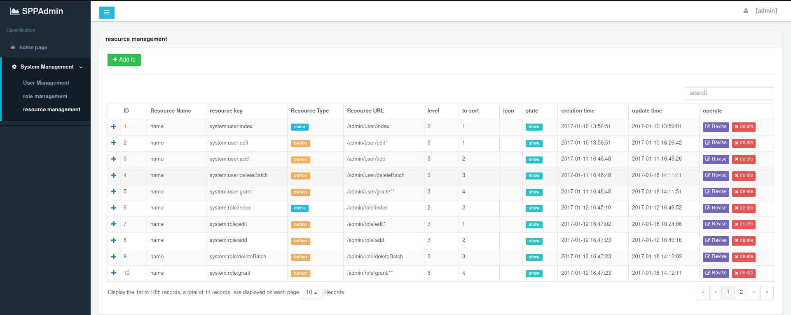

### **Build Instructions**
The project can be built from scratch by following these steps:

1. Open with **IntelliJ** the project **spring-boot-authority** located in **VulnerableFramework** folder (In IntelliJ: File > Open).

2. Go to **File > Project Structure**, Project tab and make sure that the **JDK version is 19**. To build the project **I've used JDK 19** but I've noticed that also compiling with **JDK 1.8** or other JDK versions **should** work.

 

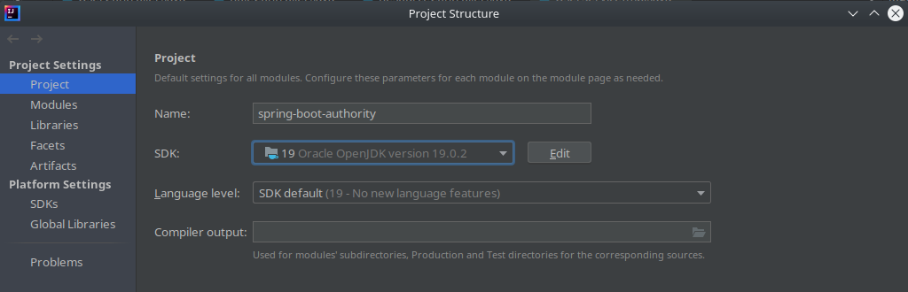

  

3. Go to **File > Settings**, expand **Build, Execution, Deployment** tab on the left, expand **Build Tools** tab and select **Maven**; make sure you are using Maven **version 3** (I've used **Maven 3.8.1** to build the project).

 

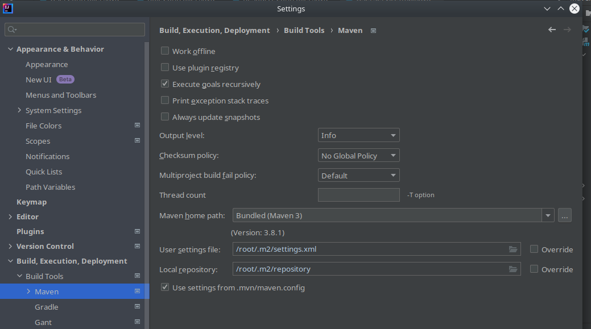

  

4. Synchronize Maven dependencies by expanding the Maven tab on the right and clicking the **Reload All Maven Projects** arrows and execute the **package** task.

 

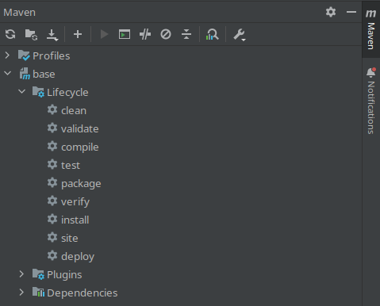

  

**ATTENTION**  
This project can be compiled successfully even withoun an instance of MySQL running, however in order to run the framework an instance of the DBMS is needed.
Parameters for the connection can be setup inside **/src/main/resources/application.properties**.

The settings that may need to be updated are the following ones:

- **spring.datasource.url** field:

~~~
jdbc:mysql://localhost:3306/base?characterEncoding=utf8&useSSL=false
~~~

where instead of **localhost:3306** you may want to insert another address (not needed if using a local docker container).

 

- **spring.datasource.username** field: *root*
- **spring.datasource.password** field: *123456*

 

In **Docker** directory I've provided both a way to launch the entire infrastructure all at once via **Docker Compose** (withouth the need of building anything), but also a way to only launch a MySQL container that can be used if it is wanted to run the application jar manually; further details will be provided in the next [section](#deployment-instructions) and in the **README.md** file inside **Docker** folder. 

### **Deployment Instructions**
This framework is composed by two different components:

1. The **application** itself that can be built following the procedure described in the previous [section](#build-instructions).

2. A **MySQL DBMS** that must be running while using the framework as all information are stored in a specific Database named **base**

 

In the **Docker** directory different configuration files can be found, here I'm going to present an overview of them:

1. **Docker Files**
    - **App_Dockerfile**: copies inside a container the jar file of the framework and executes it in order to start the application.

    - **MySQL_Dockerfile**: sets up a MySQL DBMS and initialize a default database called **base** that will be used to store application data
 

2. **Docker Compose Files**
    - **docker-compose.yml**: this **Docker Compose** file allows to deploy the two infrastructure services; it starts by launching **db** service using [this image on Docker Hub](https://hub.docker.com/repository/docker/runcor3/spring-boot-authority-mysql/general). After the latter is successfully started, it also launches **app** service using this [image](https://hub.docker.com/repository/docker/runcor3/spring-boot-authority-app/general).

 

3. **Bash Deployment Scripts**
    - **deploy_infrastructure.sh**: this simple bash script simply launches the two Docker Compose services in headless mode, waiting for 20 seconds between the launch of **db** and **app** services.

   

4. **init_sql** and **jar** directories: the former contains a **SQL script** that creates (upon MySQL container launch) a database named **base**.  The latter contains the application jar file that has been copied inside the application container when it was built.

### **Static Analysis Results**
Static Code Analysis on this project was performed using two different tools: the first one is **Spotbugs** which is integrated as a plugin within IntelliJ IDE, the second one is **SonarQube** which was deployed locally as a Docker Container. SonarQube analyses can be launched against projects by using a specific Maven or Gradle string provided by the tool itself; once the analysis is completed results can be seen in a Web Application made available by SonarQube and accessible at **localhost:9000**

#### **Spotbugs**
The two most interesting categories of bugs that Spotbugs flagged are the following ones:

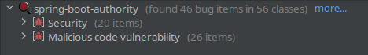

 

- **Malicious Code Vulnerabilities**

    1.  **May expose internal representation by incorporating reference to mutable object**

    2. **May expose internal representation by returning reference to mutable object**

    These are two very common bug categories that spotbugs usually flags in a project; a description of the latters has already been provided in this [README](https://github.com/RunCor399/Project_2_SVT_Arcolini_Colotti/tree/main/CVE-2021-42392), section **Static Analysis Results > Spotbugs**.

     

    3. **Mutable static field: field isn't final but should be** 
        As can be seen in this picture SpotBugs noticed that there are some fields that should be declared as **final** fields since they are consts; this type of bug is flagged as critical by SpotBugs because malicious code could be able to modify pre-defined values for consts; however this is not dangerous at all for the kind of vulnerabilities we are searching.

     

    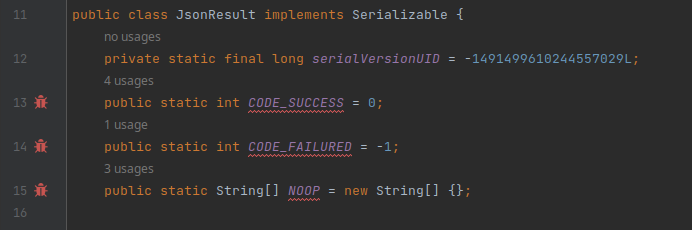

     

    4. **Mutable static field: field should be packaged protected** 
        Similarly to the previous bug, here SpotBugs is telling that const **DATE_PATTERNS** should be **package protected** in order to prevent modifications by malicious code.

     

    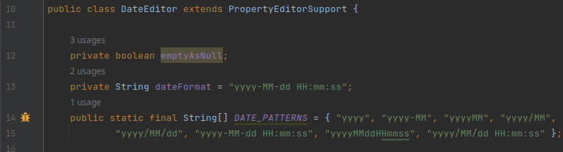

  

- **Security Vulnerabilities**
SpotBugs detected 20 security bugs, however the majority of them are just related to the intrinsic weaknesses of some criptographic algorithms that were employed in the project:

- **Weak Hash Functions**: MD2, MD4, MD5
- **Weak Ciphers**: AES-CBC-PKCS5Padding that leads to padding and integrity attacks
- **Hardcoded Initialization Vectors**

A more interesting security bug that was spotted is an **Unvalidated Redirect**
as shown in the following picture:

 

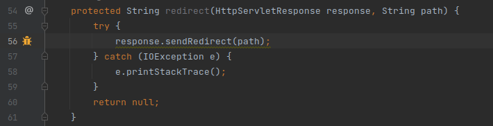

 

This type of bug could be very dangerous in case it was possible for a user to directly provide **path** parameter; this in fact would allow a threat actor to redirect other users to a phishing page for instance.
To understand if this was a potential threat or a concrete one, I've analysed the application sources searching for every piece of code invoking this **redirect** function. 

Eventually I've found out that the **redirect** function is only invoked with hardcoded paths which doesn't pose any threat.

  

#### **SonarQube**
In the following picture it is shown a overview of the static code analysis results obtained with SonarQube

 

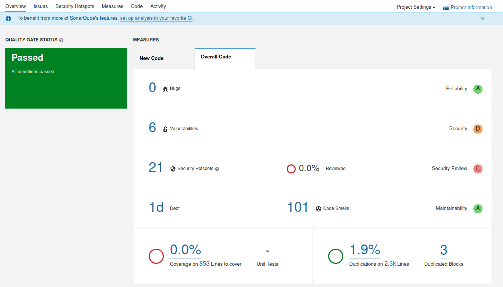

 

SonarQube detected **6 Vulnerabilities** and **21 Security Hotspots**, here the most important ones of each category will be analysed.

#### **Vulnerabilities**
Apart from the same vulnerabilities detected by SpotBugs related to the cryptographic algorithms, there is another one which is very interesting and requires further analysis:

 

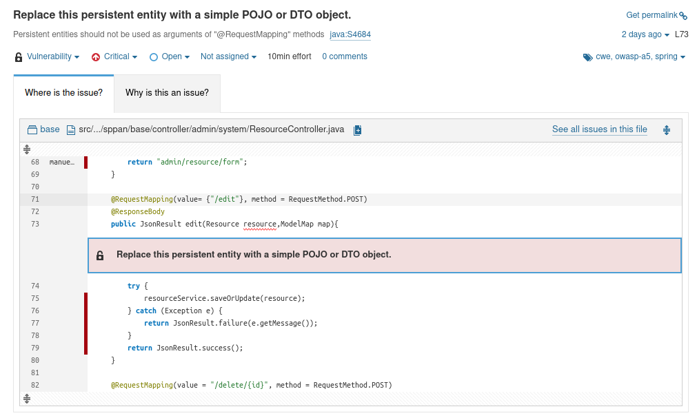

 

The **description given by SonarQube** about this vulnerability is the following:

~~~
 On one side, Spring MVC automatically bind request parameters to beans declared as arguments of methods annotated with @RequestMapping. Because of this automatic binding feature, it’s possible to feed some unexpected fields on the arguments of the @RequestMapping annotated methods.

 On the other end, persistent objects (@Entity or @Document) are linked to the underlying database and updated automatically by a persistence framework, such as Hibernate, JPA or Spring Data MongoDB.

 These two facts combined together can lead to malicious attack: if a persistent object is used as an argument of a method annotated with @RequestMapping, it’s possible from a specially crafted user input, to change the content of unexpected fields into the database.
~~~

 

Interpreting this description we can easily understand that SonarQube actually detected the vulnerability described by [CVE-2018-17369](https://nvd.nist.gov/vuln/detail/CVE-2018-17369) since it is talking about **specially crafted user input objects that may change the content of unexpected fields into the database**.  

As a matter of fact this problem was detected three times by the vulnerability scanner: once for every controller using the model classes we described before (**Resource**, **User**, **Role**) 

 

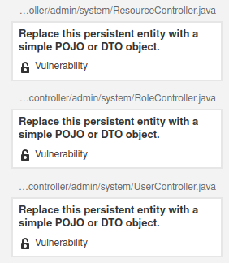

 

Even though SonarQube wasn't able to specifically tell that the vulnerability that affected the framework was a **Stored XSS**, it still was able to detect an **Injection** vulnerability.

  

#### **Security Hotspots Analysis**
Among the **21 Security Hotspots** detected by SonarQube, only 10 of them were assigned **High Review Priority** and each one of these 10 is of the same type:

- **Make sure allowing safe and unsafe HTTP methods is safe here.**  
Essentially SonarQube detected that some methods inside application controllers annotated with **@RequestMapping**, are not expressing a specific **HTTP method**; this behaviour could be dangerous because by default **all HTTP methods would be allowed**. 

 

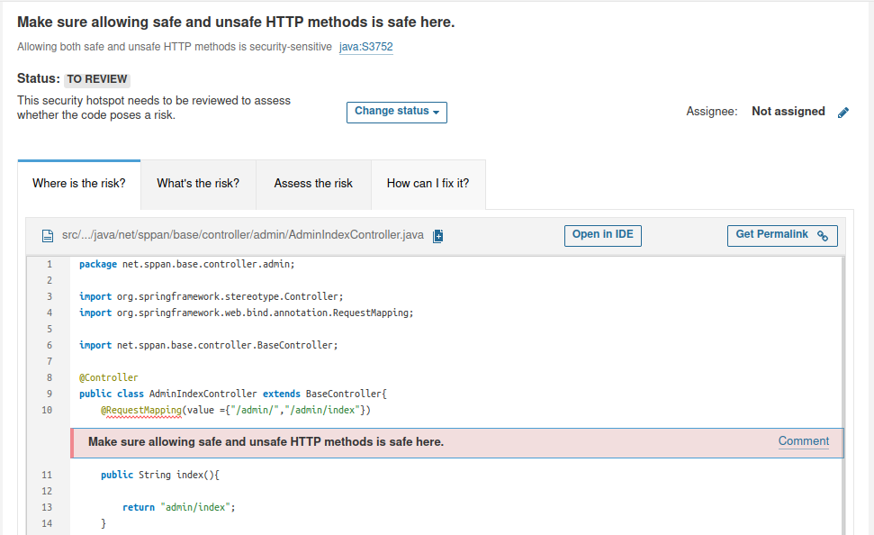

In order to mitigate this problem it is possible to specify the HTTP method that should be managed by the controller in this way:

~~~
@RequestMapping(value ={"/admin/","/admin/index"}, method = RequestMethod.POST)
~~~

## **Exploitation of the Vulnerability**
The exploitation of this vulnerability is pretty easy to be reproduced once the framework has been deployed, in following sections all the steps to perform both tasks will be explained.

### **Running the Framework**
Let's start by deploying the vulnerable framework in a dockerized enviroment:

1. Navigate to **VulnerableFramework/Docker** folder
2. Execute **deploy_infrastructure.sh** bash script

 

**deploy_infrastructure.sh** will automatically pull needed images from Docker Hub (as explained [here](#deployment-instructions)) and run the framework in two different containers: one for the **framework** itself and one for **MySQL DBMS**. Once deployment has completed it will be possible to access the login page at the following URL:

~~~
http://localhost:8080/admin/login
~~~

### **Exploit the Framework**
#### **Manual Exploitation**
To manually exploit the framework and demonstrate the presence of a Stored XSS Injection, you can follow these steps:

1. Login and reach the user management menu by following the procedure explained [here](#description), Credentials: **username**: *admin*, **password** : *111111*

 

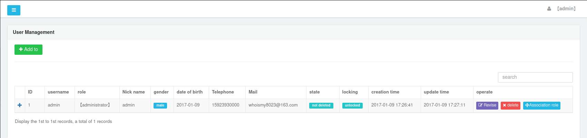

2. Once you have reached the page here above, **add a new User** by clicking the **green button**

  

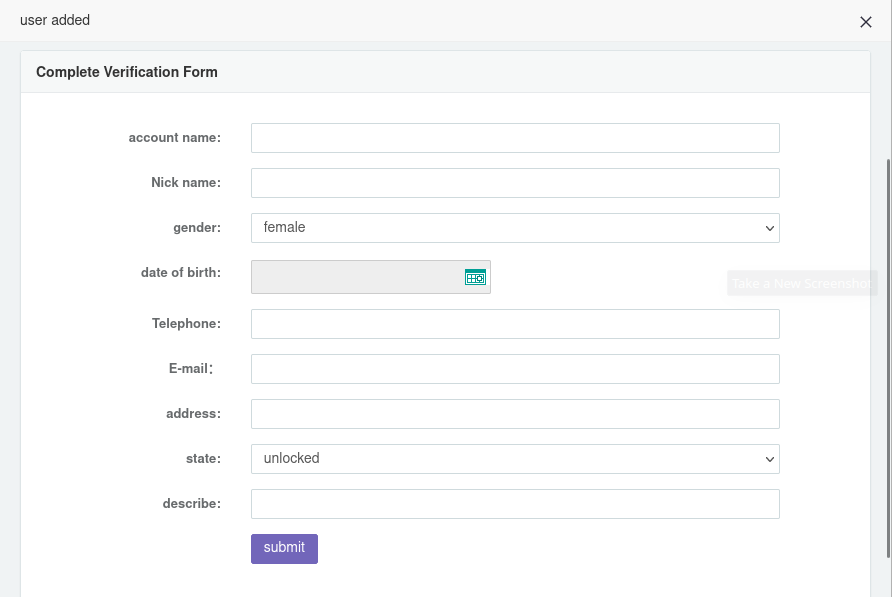

 

3. Fill in this form with random data for all fields but for the **Telephone** one, the latter has to be filled with a **Javascript or HTML payload**.
 
The reason why I've chosen this field for the injection despite all fields that accept user input are actually vulnerable, is because it can accept a lot of characters (no client-side limitations) hence longer payloads.
 
An example of payload is the following one:

~~~
">
~~~

The first two **">** characters will close the current tag in the DOM, giving the possibility to inject a malicious script or some other payload.

The result will be as the one shown here:

 

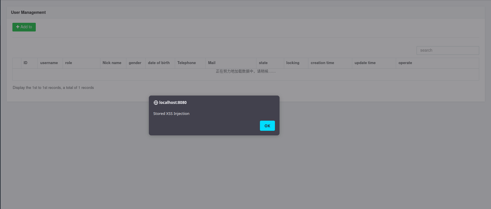

  

#### **Automatic Exploitation**
An additional way to exploit the framework has been provided in **exploit.py** script, inside **Exploit** folder.

This exploit will send a series of requests to the application in order to inject a specific payload (either the default one or a payload passed from the command line)

The default payload hardcoded within the exploit is the following one:
~~~
">
~~~
This Javascript code will simply **redirect** every user accessing the **User Management page**, to a different website chosen by the attacker (*www.malicious-phishing-page.com* in this case)

### **Analysis of the Exploitation Outcome**
As we saw in the previous section we were able to redirect users to a different webpage using only one line of Javascript code.  
In a real attack scenario an attacker may emulate and redirect users to a fake login page that looks exactly the same as the one used in the framework; once there a user would login again giving it's credentials to the attacker.

 

## **Possible Security Patch**
To patch this vulnerability it is enough to sanitize the input received by the user when adding or editing **Users**, **Roles** or **Resources**. 
To do so I've slightly changed the code of *ResourceController*, *UserController* and *RoleController* **edit** method, in order to escape all the *String* fields received as input by the user.
In the following images the resulting code can be seen:

 

- **UserController**
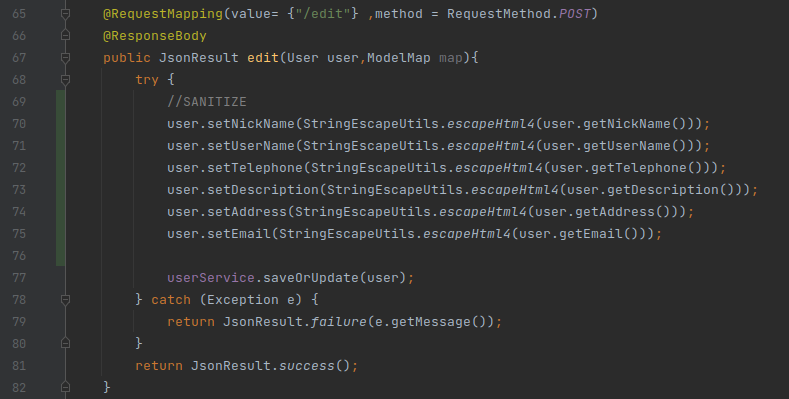

 

- **ResourceController**
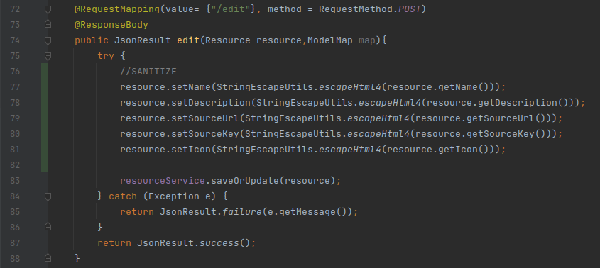

 

- **RoleController**
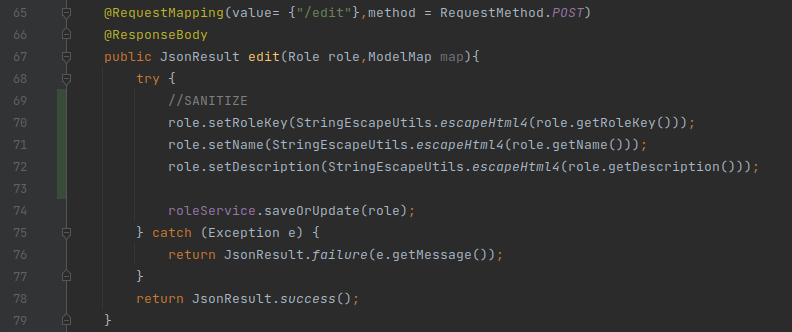