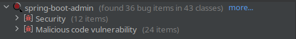

# CVE-2020-19704

1. [Contents](#Contents)
    - [Exploit Directory](#exploit-directory)
    - [VulnerableFramework Directory](#vulnerableframework-directory)
2. [The CVE](#the-cve)
    - [Details](#details)
    - [Root Cause of the Vulnerability](#root-cause-of-the-vulnerability)
    - [Potential Attack Scenario](#potential-attack-scenario)
3. [The Vulnerable Framework](#the-vulnerable-framework)
    - [Description](#description)
    - [Build Instructions](#build-instructions)
    - [Deployment Instructions](#deployment-instructions)
    - [Static Analysis Results](#static-analysis-results)
        - [Spotbugs](#spotbugs)
        - [SonarQube](#sonarqube)
        - [Security Hotspots Analysis](#security-hotspots-analysis)
    - [CVE Vulnerabilities](#cve-vulnerabilities)
4. [Exploitation of the Vulnerability](#exploitation-of-the-vulnerability)
    - [Running the Framework](#running-the-framework)
    - [Exploit the Framework](#exploit-the-framework)
    - [Analysis of the Exploitation Outcome](#analysis-of-the-exploitation-outcome)
5. [Possible Security Patch](#possible-security-patch)

## **Contents**
### **Exploit Directory**
This directory contains a single **python script** named **exploit.py** that will be used to trigger a specific vulnerability found in the application. Furthermore it is also present a **README.md** file that shows how to execute the python script.

### **VulnerableFramework Directory**
**VulnerableFramework** directory contains three different subdirectories:

- **Docker**: contains a collection of scripts and configuration files that will be used to properly run the vulnerable framework in a dockerized enviroment.

- **spring-boot-admin**: contains the **spring-boot-admin** projects sources from which the framework can be built.

- **jar**: contains a jar file of the application.

Additional information about the **Docker** directory contents as well as information on how to deploy the framework, can be obtained by reading the **README.md** file within this same folder.

## **The CVE**
### **Details**
In this section a detailed description of **CVE-2020-19704** will be provided, the following is a first description provided by the NIST:

> A stored cross-site scripting (XSS) vulnerability via ResourceController.java in spring-boot-admin as of 20190710 allows attackers to execute arbitrary web scripts or HTML.

This CVE refers to an open source project called [Spring-Boot-Admin](https://github.com/sail-y/spring-boot-admin) that contains a **Stored XSS** vulnerability that was flagged in a Github [issue](https://github.com/sail-y/spring-boot-admin/issues/7) by a project contributor.

### **Root Cause of the Vulnerability**
The root cause of the vulnerability is that when a **PUT** request is sent to the **/resource** endpoint, the body doesn't get sanitized and some of the input directly provided by the user, gets inserted in the DOM of the webpage causing a code injection.

In the following screenshot it is possible to notice how the **resource** received in the body is simply passed to the **ResourceService** which in turn will map it to a **Resource** model object.

### **Potential Attack Scenario**
As a potential attack scenario we could think about the situation in which a **Spring Boot** application is using this framework for **resources and roles management**.

In order for the attack to be feasible there is only one requirement: the attacker must be authenticated to the backend management system and able send **PUT** requests to the **/resource** endpoint.

## **The Vulnerable Framework**
### **Description**
The vulnerable framework I've identified is the same one for which [CVE-2020-19704](https://nvd.nist.gov/vuln/detail/CVE-2020-19704) was issued and it is called [Spring-Boot-Admin](https://github.com/sail-y/spring-boot-admin): an open source **Background Management System** used for handling **user-roles** and **application resources**.

 

After having [deployed the framework](#deployment-instructions), the following login page can be retrieved at the URL **http://localhost:10000/web/views/login/login.html**.

 

**Login Page**

 

By using as username "**admin**" and as password "**111111**", you will be redirected to the homepage shown here below:

  

To access the resources menu just **expand the only option** inside the **left sidebar** and then **click the first option** that appears, as shown in the picture.

  

The page shown here below is the one from which an admin can customize the active resources of a Spring Boot application; in section [Exploitation of the Vulnerability](#exploitation-of-the-vulnerability) we will resume from this page in order to exploit the **stored XSS vulnerability**

### **Build Instructions**
The project can be built from scratch by following these steps:

1. Open with **IntelliJ** the project **spring-boot-admin** located in **VulnerableFramework** folder (In IntelliJ: File > Open).

2. Go to **File > Project Structure**, Project tab and make sure that the **JDK version is 1.8**. To build the project **I've used JDK 1.8** with **Language Level 8 - Lambdas, type annotations etc**.

 

  

3. Go to **File > Settings**, expand **Build, Execution, Deployment** tab on the left, expand **Build Tools** tab and select **Maven**; make sure you are using Maven **version 3** (I've used **Maven 3.8.1** to build the project).

 

  

4. Synchronize Maven dependencies by expanding the Maven tab on the right and clicking the **Reload All Maven Projects** arrows and execute the **package** task.

 

  

**ATTENTION!**  
This project in order to be compiled and packaged in a **.jar** file, **requires a MySQL DBMS** instance running.  
If it is wanted to manually build this project, it will be necessary to execute a MySQL DBMS (for example with **Docker**) and to properly change the connection settings that can be found in the configuration file **/src/main/resources/application-dev.yml**.

The settings that may need to be updated are the following ones:

- **url** field: 
~~~ 
jdbc:mysql://localhost:3306/dmc?useUnicode=true&characterEncoding=utf8&autoReconnect=true&rewriteBatchedStatements=TRUE&useSSL=false 
~~~

where instead of **localhost:3306** you may want to insert another address (not needed if using a local docker container).

 

- username field: **user** 
- password field: **password**

 

In **Docker** directory I've provided both a way to launch the entire infrastructure all at once via **Docker Compose** (withouth the need of building anything), but also a way to only launch a MySQL container that can be used in the building phase; further details will be provided in the next [section](#deployment-instructions) and in the **README.md** file inside **Docker** folder. 

### **Deployment Instructions**
This framework is composed by two different components:

1. The **application** itself that can be built following the procedure described in the previous [section](#build-instructions).

2. A **MySQL DBMS** that must be running while using the framework as all information are stored in a specific Database named **dmc**

 

In the **Docker** directory many configuration files can be found, here I'm going to present an overview of them:

1. **Docker Files**
    - **App_Dockerfile**: copies the sources of **spring-boot-admin** project inside a container that will build those using **Maven** and generate a **.jar** file that will be executed upon container launch.

    - **MySQL_Dockerfile**: Sets up a MySQL DBMS and executes a **.sql** script (provided by the framework developers in **spring-boot-admin/dmc/dmc.sql**) that is in charge of creating and populating the tables needed by the framework.

    The images built using these two configuration files will automatically be pulled from **Docker Hub** when using **Docker Compose**.

2. **Docker Compose Files**
    - **docker-compose-build-app.yml**: This **Docker Compose** file will launch a MySQL **db** service and will **build the Docker Image** of the application starting from the **App_Dockerfile** configuration file.

         

        The only reason why I've used this file is because I couldn't build the **App_Dockerfile** by itself as the framework requires also the MySQL DBMS running during the build phase; to overcome this problem I've built the image while having the DBMS running so that I could also tag and push the same image on **Docker Hub**.

     

    - **docker-compose.yml**: This last **Docker Compose** file is the only one that is needed in order to deploy the whole infrastructure; it launches a **db** service (MySQL DBMS) and an **app** service, retrieving the images respectively from [this](https://hub.docker.com/repository/docker/runcor3/spring-boot-admin-mysql/general) and [this](https://hub.docker.com/repository/docker/runcor3/spring-boot-admin-app/general) **Docker Hub repositories**.

     

3. **Bash Deployment Scripts**
    - **build_and_deploy.sh**: This bash script invokes Docker Compose with **docker-compose-build-app.yml** configuration file. There is no need to launch this script unless it is wanted to build from scratch a docker image for the application.

    - **deploy_infrastructure.sh**: With this bash script it will be possible to deploy the whole infrastructure, it only relies on the presence of the **docker-compose.yml**.   Upon launch the script:  
        
        1. Launches with Docker Compose the **MySQL service**
        2. Sleeps 20 seconds to wait for the complete start-up of the previous service
        3. Launches with Docker Compose the **Application**

    

### **Static Analysis Results**
Static Code Analysis on this project was performed using two different tools: the first one is **Spotbugs** which is integrated as a plugin within IntelliJ IDE, the second one is **SonarQube** which was deployed locally as a Docker Container. SonarQube analyses can be launched against projects by using a specific Maven or Gradle string provided by the tool itself; once the analysis is completed results can be seen in a Web Application made available by SonarQube and accessible at **localhost:9000**

#### **Spotbugs**
The two most interesting categories of bugs that Spotbugs flagged are the following ones:

 

- **Malicious Code Vulnerabilities**

    1.  **May expose internal representation by incorporating reference to mutable object**

    2. **May expose internal representation by returning reference to mutable object**

    These are two very common bug categories that spotbugs usually flags in a project; a description of the latters has already been provided in this [README](https://github.com/RunCor399/Project_2_SVT_Arcolini_Colotti/tree/main/CVE-2021-42392), section **Static Analysis Results > Spotbugs**.

 

For reference, here below there is an example of each of the two bugs in the current project:

 

- *May expose internal representation by incorporating reference to mutable object*

  

- *May expose internal representation by returning reference to mutable object*

  

- **Security Vulnerabilities**

In this screenshot we can see that Spotbugs detected several potential security bugs divided in 5 categories
 

 

This analysis will only give a further look at the "**Potential XSS in Servlet**" since most of the bugs related to the other categories have also been explained in [SonarQube Security Hotspots Analysis](#security-hotspots-analysis)

 

From the picture below we can see the interesting piece of code flagged by Spotbugs:

 

The reason why it gets detected as a potential XSS is because there is no sanitization of the response sent to the client through the method "**response.getWriter().println(JsonUtil.toJsonString(restResp))**".

To understand if this is a real Cross-site scripting vulnerability we need to find out if any user-provided input could get returned inside **restResp** object.
In line 33 we can immediately see how the content of **restResp** is not dangerous since it only contains **two hardcoded values**: a code and a message.

Because of this we have established that this was just a Spotbugs **false positive**

  

#### **SonarQube**
In the following picture it is shown a overview of the static code analysis results obtained with SonarQube

 

 

**0 Vulnerabilities** and **13 Security Hotspots** were detected during the analysis, Security Hotspots are potential vulnerabilities flagged by SonarQube that need further analysis by a human.

#### **Security Hotspots Analysis**
The 13 Security Hotspots detected can be divided in three classes as shown in this overview:  

 

In this analysis I will only take into consideration the **Cross-Site Request Forgery (CSRF)** hotspots, as they were flagged with a **HIGH review priority**.
  Among these 4 high priority hotspots we can identify only to types of potential vulnerabilities:

 

1. **Make sure allowing safe and unsafe HTTP methods is safe here**

In this piece of code we can see that the **@RequestMapping** is not specifying an HTTP method bound to this controller; this behaviour could be very risky because by default all HTTP methods would be allowed.  

In order to mitigate this problem it is possible to specify the HTTP method that should be managed by the controller in this way:

~~~
@RequestMapping("/editPwd", method = RequestMethod.PUT)
~~~

  

2. **Make sure disabling Spring Security's CSRF protection is safe here**

 

The second type of security hotspot detected by SonarQube regards the explicit deactivation of CSRF protection, this latter mechanism is provided by Spring Security and allows to prevent Cross-Site Request Forgery attacks by embedding a specific CSRF token that must be submitted to the server on every HTTP request that modifies the state.

Not having this protection in place could allow an attacker to provide a link to a specifically crafted page, potentially triggering a Cross-Site Request Forgery.

 

### **CVE Vulnerabilities**
The two vulnerability scanners weren't able to detect the [XSS Stored Injection](https://nvd.nist.gov/vuln/detail/CVE-2020-19704) by which this framework is affected. The reason of this is that the free version of SonarQube we are using is not able to detect CVE vulnerabilities; on the other hand SpotBugs should be able to detect this kind of code vulnerability but as can be seen from analysis results it only detected a potential XSS not related with the one of **CVE-2020-19704**.

## **Exploitation of the Vulnerability**
The exploitation of this vulnerability is pretty easy to be reproduced once the framework has been deployed, in following sections all the steps to perform both tasks will be explained.

### **Running the Framework**
Let's start by deploying the vulnerable framework in a dockerized enviroment:

1. Navigate to **VulnerableFramework/Docker** folder
2. Execute **deploy_infrastructure.sh** bash script

 

**deploy_infrastructure.sh** will automatically pull needed images from Docker Hub (as explained [here](#deployment-instructions)) and run the framework in two different containers: one for the **framework** itself and one for **MySQL DBMS**. Once deployment has completed it will be possible to access the login page at the following URL:

~~~
http://localhost:10000/web/views/login/login.html
~~~

### **Exploit the Framework**
#### **Manual Exploitation**
To manually exploit the framework and demonstrate the presence of a Stored XSS Injection, you can follow these steps:

1. Login and reach the resources menu by following the procedure explained [here](#description), Credentials: **username**: *admin*, **password:**: *111111*

 

2. Once you have reached the page here above, click on the **edit** button of one of the listed endpoint

  

 

3. In this form modify the **Resource address** field, here is where our Javascript or HTML payload has to be inserted in order to trigger the vulnerability; keep in mind that **Resource address is not the only field that causes injection**. An example of payload is the following one:

~~~
">
~~~

The first two **">** characters will close the current tag in the DOM, giving the possibility to inject a malicious script or some other payload.

The result will be as the one shown here:

 

  

#### **Automatic Exploitation**
An additional way to exploit the framework has been provided in **exploit.py** script, inside **Exploit** folder. This exploit will perform two separate tasks:

1. First it will send a series of requests to the application in order to inject a specific payload (either the default one or a payload passed from the command line)

    The default payload hardcoded within the exploit is the following one:
    ~~~
    ">
    ~~~
    This Javascript code will simply log every key pressed by users, and send them to an **HTTP Server** on port 8888

 

2. If you are using the default payload and it has been injected correctly, the exploit will automatically start the HTTP Server, log requests received by it (shown in standard output) and log all keys pressed by users in a file named **log_output.txt** 

3. If everything worked as expected, the server will now receive requests from the application as soon as a user has his mouse focused on the resources page and he/she presses a button. This result can be observed in the two following screenshots:

 

**HTTP Server Output**

 

Word "*test*" was written while using the application web page leading to this output:

 

**Log File Output**

  

### **Analysis of the Exploitation Outcome**
As we saw from the previous attack we were able to install a sort of keylogger capable of loggin every key pressed by users, but this is not the only type of attack that could be performed exploiting a **Stored XSS** vulnerability.

Among the many attacks the following ones are worth a mention:

- **Cookie Stealing**: a Javascript payload can easily send to an attacker-controlled server the user's cookies stored client-side. This may also lead to **session hijacking** if among the cookies there are also **session cookies**.

- **Phishing**: The attacker can use an XSS payload to create a fake login form that looks like the site's legitimate login form and trick the user into entering their login credentials.

- **Defacement**: The attacker can use an XSS payload to replace the legitimate content of the site with their own content

 

## **Possible Security Patch**
To patch this vulnerability it is enough to sanitize the input received by the user when he's editing one of the resources.

In order to fix the code I had to change the behaviour of the **edit** method as follows:

The original code was directly mapping the request body to a Resource object and passing it as a parameter to the **resourceService.edit()** method (line 78)
 

In order to patch this vulnerability I've modified the code to escape the 3 user-provided textual fields that could cause a code injection (**url**, **name** and **remark**), using the utility **StringEscapeUtils.escapeHtml4()** provided by the library **org.apache.commons**.
