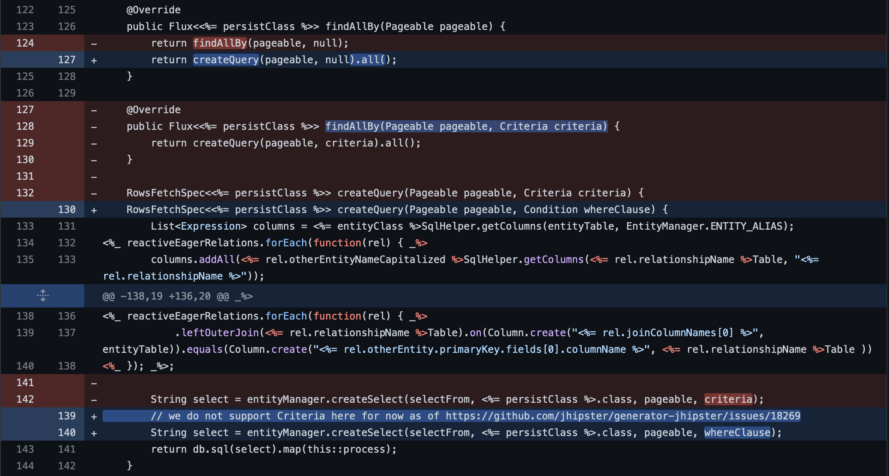

# CVE-2022-24815

> [...] Currently, SQL injection is possible in the findAllBy(Pageable pageable, Criteria criteria) method of an entity repository class generated in these applications as the where clause using Criteria for queries are not sanitized and user input is passed on as it is by the criteria. [...]


1. [Contents](#contents)
2. [TL;DR](#tldr)
3. [The CVE](#the-cve)
    1. [Details](#details)
    2. [Opened issue and pull request](#opened-issue-and-pull-request)
4. [Generate the application](#generate-the-application)
    1. [JHipster](#jhipster)
        1. [Requirements](#requirements)
        2. [Installing JHipster](#installing-jhipster)
    2. [Crafting vulnerableApplication](#crafting-vulnerableapplication)
        1. [Generate an application with JHipster](#generate-an-application-with-jhipster)
        2. [Add a new Entity](#add-a-new-entity)
        3. [Disable API Authentication](#disable-api-authentication)
        4. [Request parameter](#request-parameter)
5. [Run the application](#run-the-application)
6. [Run the exploit](#run-the-exploit)


## Contents
This directory contains the material related to **CVE-2022-24815**. All the material used in the research, development, testing and exploiting of the vulnerability, can be found here. In particular, the content of this repository is the following:
- `README.md`: this file. It contains the report in markdown format, with all the information regarding the CVE, the vulnerable application and the reproduced exploit.
- `Runnable`: it contains the runnable vulnerable application. The application can either start locally (as it is delivered as an executable `.jar`) or as a Docker container (in a already prepared and configured environment). Please refer to the [Run the application](#run-the-application) section for more information.
- `VulnerableApplication`: it contains the source code of the vulnerable application. The application has been generated with the CVE affected version of JHipster. More details can be found in the section: [Generate the application](#generate-the-application).
- `Attacker`: it contains the python script used as Proof of Concept to exploit the CVE vulnerability. More details can be found in the section: [Run the exploit](#run-the-exploit).
- `Images`: it contains images used in this file.

## TL;DR
We are dealing with an SQL injection vulnerability found in the JHipster developing platform. The generated entity class may allow an arbitrary user to inject a non-sanitized query parameter that will be processed as a SQL `Criteria` and executed by the entity repository class. 

To run the vulnerable application, move to [Runnable](./Runnable/) and run the following command: 
```bash
./run-docker.sh
```

This will start the application, listening on `localhost:8080`.

> **NB**: remember to start the docker deamon. 

To run the exploit, move to [Attacker](./Attacker/) and run the following commands:
```bash
pip install -r requirements.txt
python3 exploit.py localhost:8080
```

## The CVE
This section contains detailed information and analysis of the considered CVE ([CVE-2022-24815](https://nvd.nist.gov/vuln/detail/CVE-2022-24815)).

The CVE states that: 

> JHipster is a development platform to quickly generate, develop, & deploy modern web applications & microservice architectures. SQL Injection vulnerability in entities for applications generated with the option "reactive with Spring WebFlux" enabled and an SQL database using r2dbc. Applications created without "reactive with Spring WebFlux" and applications with NoSQL databases are not affected. Users who have generated a microservice Gateway using the affected version may be impacted as Gateways are reactive by default. Currently, SQL injection is possible in the `findAllBy(Pageable pageable, Criteria criteria)` method of an entity repository class generated in these applications as the where clause using `Criteria` for queries are not sanitized and user input is passed on as it is by the criteria. This issue has been patched in `v7.8.1`. Users unable to upgrade should be careful when combining criteria and conditions as the root of the issue lies in the `EntityManager.java` class when creating the `where` clause via `Conditions.just(criteria.toString())`, `just` accepts the literal string provided. Criteria's `toString` method returns a plain string and this combination is vulnerable to sql injection as the string is not sanitized and will contain whatever used passed as input using any plain SQL. 

### Details
As stated in the description, the SQL injection is possible due to the `findAllBy()`, which call the `createQuery()` method defined as:
```java
RowsFetchSpec<Example> createQuery(Pageable pageable, Criteria criteria) {
    List<Expression> columns = ExampleSqlHelper.getColumns(entityTable, EntityManager.ENTITY_ALIAS);
    SelectFromAndJoin selectFrom = Select.builder().select(columns).from(entityTable);

    String select = entityManager.createSelect(selectFrom, Example.class, pageable, criteria);
    return db.sql(select).map(this::process);
}
```
This method accepts as parameter a `Criteria`, which can be easily injected by the user if an endpoint is provided to filter a search in the database and the user supplied parameter has not been properly sanitized. The `Criteria` is then used in the `EntityManager` to create a query. This method signature has been patched to the following: 
```java
RowsFetchSpec<Example> createQuery(Pageable pageable, Condition whereClause) {
    List<Expression> columns = ExampleSqlHelper.getColumns(entityTable, EntityManager.ENTITY_ALIAS);
    SelectFromAndJoin selectFrom = Select.builder().select(columns).from(entityTable);
        
    // we do not support Criteria here for now as of https://github.com/jhipster/generator-jhipster/issues/18269
    String select = entityManager.createSelect(selectFrom, Example.class, pageable, whereClause);
    return db.sql(select).map(this::process);
}
```
With this workaround, JHipster does not support `Criteria` anymore.

### Opened issue and pull request
The vulnerability has been discovered on April 4, 2022 by [appkr](https://github.com/appkr) and it has been publicly discussed over the course of the night between the 4th and the 5th on [this](https://github.com/jhipster/generator-jhipster/issues/18269) GitHub issue's thread. 

A [pull request](https://github.com/jhipster/generator-jhipster/pull/18294), named ***use conditions instead of criteria as workaround*** was created on April 5, containing the two commits pushed as workaround to the vulnerability. In particular, in this [commit](https://github.com/jhipster/generator-jhipster/pull/18294/commits/c220a210fd7742c53eea72bd5fadbb96220faa98) it is possible to see how the Java class generator has been changed in order to disallow the usage of `findAllBy(Pageable pageable, Criteria criteria)`:



Moreover, the `EntityManager` class generator has been modified from:
```java
public String createSelect(SelectFromAndJoinCondition selectFrom, Class<?> entityType, Pageable pageable, Criteria criteria) 
```
to 
```java
public String createSelect(SelectFromAndJoinCondition selectFrom, Class<?> entityType, Pageable pageable, Condition where)
```
moving from the usage of `Criteria` to the usage of `Condition`.

## Generate the application
This section describes how to generate the application from scratch, using `generator-jhipster`, and configure it to replicate both the CVE vulnerability and the proposed exploit. If you would like to run the already generated vulnerable application, refers to the following section ([Setting up the application](#setting-up-the-application)).

> **NB**: more detailed documentation can be found either on the GitHub repository ([generator-jhipster](https://github.com/jhipster/generator-jhipster)) or on the official website ([jhipster.tech](https://www.jhipster.tech/)).

### JHipster
```bash
        ██╗ ██╗   ██╗ ████████╗ ███████╗   ██████╗ ████████╗ ████████╗ ███████╗
        ██║ ██║   ██║ ╚══██╔══╝ ██╔═══██╗ ██╔════╝ ╚══██╔══╝ ██╔═════╝ ██╔═══██╗
        ██║ ████████║    ██║    ███████╔╝ ╚█████╗     ██║    ██████╗   ███████╔╝
  ██╗   ██║ ██╔═══██║    ██║    ██╔════╝   ╚═══██╗    ██║    ██╔═══╝   ██╔══██║
  ╚██████╔╝ ██║   ██║ ████████╗ ██║       ██████╔╝    ██║    ████████╗ ██║  ╚██╗
   ╚═════╝  ╚═╝   ╚═╝ ╚═══════╝ ╚═╝       ╚═════╝     ╚═╝    ╚═══════╝ ╚═╝   ╚═╝
```

What is **JHipster**?
> JHipster is a development platform to quickly generate, develop, & deploy modern web applications & microservice architectures. 

It is an open-source community-driven software hosted on GitHub ([generator-jhipster](https://github.com/jhipster/generator-jhipster)). 


#### Requirements
> **NB**: for the official documentation, please refers to the official website ([jhipster.tech](https://www.jhipster.tech/installation/)).

In order to install and use `generator-jhipster`, you will need to have installed on your local machine: 
- **Java SE**:  as there are several versions of Java, the one recommended here is `Eclipse Temurin`, the open source Java SE build based upon OpenJDK. However, the application has been tested using `java 17.0.6 2023-01-17 LTS`. As a reminder, to check the version of Java installed run the command: 
    ```bash
    java --version
    ```
- **Node.js**: an LTS 64-bit version is required, since non-LTS versions are not supported. As a reminder, to check the version of Node.js installed run the command: 
    ```bash
    node --version
    ```
- **Maven**: eventually, JHipster will automatically install the Maven Wrapper. As a reminder, to check the version of Maven installed run the command: 
    ```bash
    maven --version
    ```

#### Installing JHipster
Once the requirements have been dealt with, `generator-jhipster` can be installed globally as a `npm` package with the command:
```bash
npm -g install generator-jhipster@<version>
```
As specified in the CVE details, in order to replicate the vulnerability, you will need to install versions from version `7.7.0` up to (and not included) version `7.8.1`. 

> **NB**: the vulnerable [application](./VulnerableApplication/) has been generated with JHipster version `7.7.0`.

Check that the specified version has been correctly installed by running the command:
```bash
npm -g list | grep generator-jhipster
``` 

### Crafting vulnerableApplication
To generate the vulnerable application and replicate the vulnerability, you will need to perform a couple a tasks:
1. generate an application with Jhipster;
2. add a new `Examples` Entity with JHipster;
3. disable API Authentication (you will not need authentication and this will speed up the process);
4. make the `/api/examples` accepts a `name` query parameter and bind it to the `findAllBy(Pageable pageable, Criteria criteria)` repository method;
5. run the exploit.

#### Generate an application with JHipster
Once a vulnerable version of JHipster has been correctly installed, you can generate a new application by creating a new folder (e.g., `vulnerableApp`) and running `jhipster`. JHipster will ask to configure the application stack. In particular, in order to replicate the vulnerability, you will need to configure the following:
- (having a vulnerable version of JHipster);
- using a Reactive Relational Database Connectivity (`r2dbc`) with SpringFlux;
- using a SQL database.

Here the complete list of answers used to configure JHipster:
| JHipster | Configuration |
|:--:|:--:|
| Which *type* of application would you like to create? | Monolithic application (recommended for simple projects) |
| What is the base name of your application? | testApp |
| Do you want to make it reactive with Spring WebFlux? | ***Yes*** |
| What is your default Java package name? | it.polito.vulnapp |
| Which *type* of authentication would you like to use? | HTTP Session Authentication (stateful, default Spring Security mechanism) |
| Which *type* of database would you like to use? | SQL (H2, PostgreSQL, MySQL, MariaDB, MSSQL) |
| Which *production* database would you like to use? | ***MySQL*** |
| Which *development* database would you like to use? | H2 with in-memory persistence |
| Would you like to use Maven or Gradle for building the backend? | Maven |
| Do you want to use the JHipster Registry to configure, monitor and scale your application? | No |
| Which other technologies would you like to use? |  |
| Which *Framework* would you like to use for the client? | No client |
| Would you like to enable internationalization support? | No |
| Please choose the native language of the application | English |
| Besides JUnit and Jest, which testing frameworks would you like to use?Besides JUnit and Jest, which testing frameworks would you like to use? |  |
| Would you like to install other generators from the JHipster Marketplace? | No |

#### Add a new Entity
Once the application has been generated, you will need to create a new **Entity** (e.g., `Example`). JHipster will take care of everything. Therefore, you will only need to create a `.jdl` file, i.e. [**JHipster Domain Language**](https://www.jhipster.tech/jdl/getting-started) (**JDL**), containing the following information: 
```jdl
entity Example {
	id String
    name String
}
```
Now, you can run the JHipster command: 
```bash
jhipster jdl example.jdl
```
and JHipster will generate, add to the project and manage all the files related to this new Entity. 

> **NB**: if prompted to overwrite `src/main/resources/config/liquibase/master.xml`, confirm the operation.

#### Disable API Authentication
In order to speed up the process and avoiding to sign up as a new user and log in every time, you can disable the `/api` authentication filter in `src/main/java/com/mycompany/myapp/config/SecurityConfiguration.java`. Initially, the endpoint will be marked by JHipster as `authenticated()`, but we can change it to: 
```java
.pathMatchers("/api/**").permitAll()
```
> **NB**: this operation has nothing to do with the exploit per se. Indeed, the CVE does not requires authentication, as stated in the CVE details: `Authentication - Not required (Authentication is not required to exploit the vulnerability.)`. The API Authentication has been removed with the intent to avoid the sign up/log in routine every time the exploit is running. However, authentication can be performed and the user (or the attacker) will be required to perform a log in operation before accessing the API.

#### Request parameter
You need now to expose an endpoint that allows users to specify a `Criteria` to perform the SQL query. In particular, JHipster will automatically generate the following endpoint (in: `src/main/java/com/mycompany/myapp/web/rest/ExampleResource.java`) for you: 
```java
/**
 * {@code GET  /examples} : get all the examples.
 *
 * @return the {@link ResponseEntity} with status {@code 200 (OK)} and the list of examples in body.
*/
@GetMapping("/all-examples")
public Mono<List<Example>> getAllExamples() {
    log.debug("REST request to get all Examples");
    return exampleRepository.findAll().collectList();
}
```
that is intended to accept a `GET` request and return the list of `Example` Entities as a JSON object.

You can now create a similar endpoint as:
```java
/**
 * {@code GET  /examples} : get all the examples.
 * {@param name} : filter name used as Criteria in the SQL query
 *
 * @return the {@link ResponseEntity} with status {@code 200 (OK)} and the list of examples in body.
 */
@GetMapping("/examples")
public Mono<List<Example>> getExamplesWithName(@RequestParam("name") String name) {
    log.debug("REST request to get all Examples by name");
    final Criteria criteria = where("name").is(name);
    return exampleRepository.findAllBy(null, criteria).collectList();
}
```

This new endpoint can be used by declaring a query parameter called `name` that will be used to search in the database the corresponding entry. It will be using the vulnerable `findAllBy(Pageable pageable, Criteria criteria)` method generated by JHipster, passing as criteria the non-sanitized input from the user. 

That's all. The vulnerable application is now ready to be exploited. For more details, please refers to the following section ([Run the exploit](#run-the-exploit)).

## Run the application
Previous section described how to generate the vulnerable application from scratch. If you would like to use an already configured vulnerable application, you can use the one provided in [Runnable](./Runnable/).

The folder contains two files: 

| File | Use |
|:-:|:-:|
| `run-docker.sh` | Build and run a containerized application from the `.jar` target file. The container is prepared such that you should not be required to install Java or other dependencies. |
| `run-local.sh` | Run locally the `vulnerable-application.jar` built from the vulnerable application. Note that this requires Java installed. |

The application will start a HTTP server at `localhost`, port `8080`.


## Run the exploit
This section describes the (simple) python script used as **Proof of Concept** (PoC) to exploit the vulnerability defined in CVE-2022-24815. 

The content of the script can be found in the [Attacker](./Attacker/) folder. For more detailed information, please refer to the `README.md` that you find in that directory.

Before running the script, make sure to have installed all the required modules and packages contained in the `requirements.txt`:
```bash
pip install -r requirements.txt
```

Now, you can start the exploiter with the command: 
```bash
python3 exploit.py <HOST:PORT>
```
