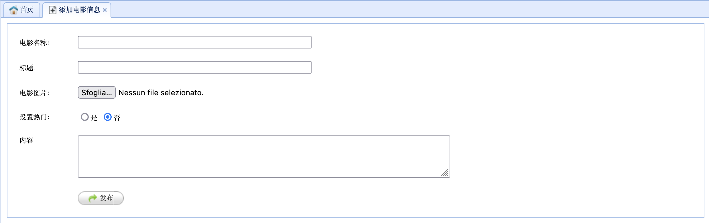
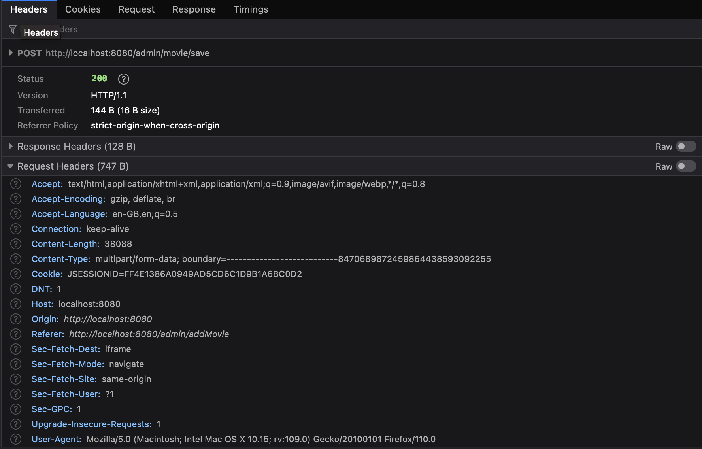
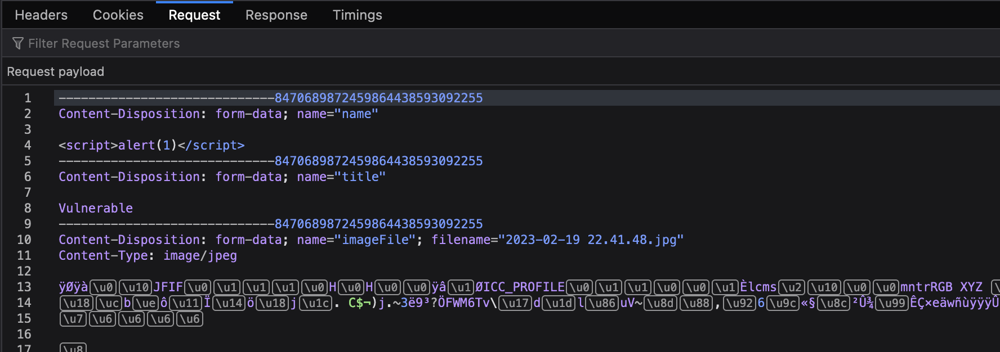
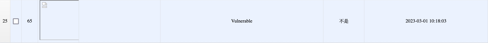
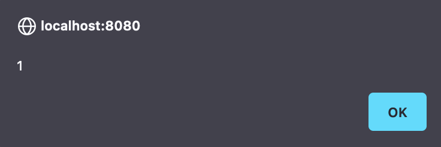
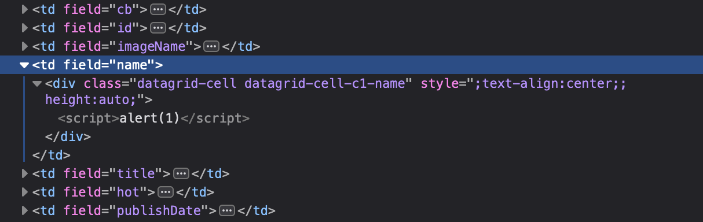
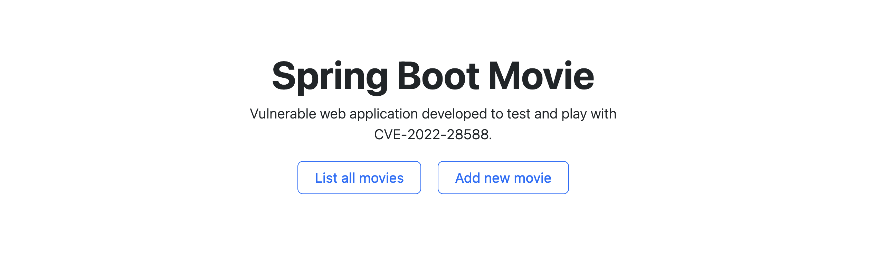
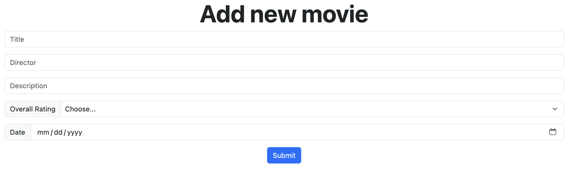

# CVE-2022-28588

> In SpringBootMovie <=1.2 when adding movie names, malicious code can be stored because there are no filtering parameters, resulting in stored XSS.

1. [Content](#contents)
2. [TL;DR](#tldr)
3. [The CVE](#the-cve)
    1. [Details](#details)
    2. [Stored XSS](#stored-xss)
4. [The vulnerable application](#the-vulnerable-application)
    1. [Analysis of the original application](#analysis-of-the-original-application)
    2. [Analysis of the extracted code-sample](#analysis-of-the-extracted-code-sample)
5. [Run the application](#run-the-application)
6. [Run the exploit](#run-the-exploit)


## Contents
This directory contains the material related to **CVE-2022-28588**. All the material used in the research, development, testing and exploiting of the vulnerability, can be found here. In particular, the content of this repository is the following:
- `README.md`: this file. It contains the report in markdown format, with all the information regarding the CVE, the vulnerable application and the reproduced exploit.
- `Runnable`: it contains the runnable vulnerable application. The application can either start locally (as it is delivered as an executable `.jar`) or as a Docker container (in a already prepared and configured environment). Please refer to the [Run the application](#run-the-application) section for more information.
- `VulnerableApplication`: it contains the source code of the vulnerable application. The application represents a simplified vulnerable version extracted from the [`SpringBootMovie`](https://github.com/lkmc2/SpringBootMovie) application. Please refer to the [The vulnerable application](#the-vulnerable-application) section for more information.
- `Attacker`: it contains the python script used as Proof of Concept to exploit the CVE vulnerability. More details can be found in the section: [Run the exploit](#run-the-exploit).
- `Images`: it contains images used in this file.


## TL;DR
We are dealing with a [stored XSS](https://cwe.mitre.org/data/definitions/79.html) vulnerability found in the `POST /admin/movie/save` exposed endpoint of the [`SpringBootMovie`](https://github.com/lkmc2/SpringBootMovie) application. The controller does not properly sanitize the movie-related information the user inputs with the client form. The user's input will be stored as is, and the Thymeleaf template will render the application pages containing malicious source of data, potentially executing the injected scripts.

To run the vulnerable application, move to [Runnable](./Runnable/) and run the following command: 
```bash
./run-docker.sh
```

This will start the application, listening on `localhost:8080`.

> **NB**: remember to start the docker deamon. 

To run the exploit, move to [Attacker](./Attacker/) and run the following commands:
```bash
pip install -r requirements.txt
python3 exploit.py localhost:8080
```

Then, open a browser, connect to `localhost:8080` and hit the `List all movies` button. This will execute the injected script.

## The CVE
This section contains detailed information and analysis of the considered CVE ([CVE-2022-28588](https://nvd.nist.gov/vuln/detail/CVE-2022-28588)).

The CVE states that: 

> In SpringBootMovie <=1.2 when adding movie names, malicious code can be stored because there are no filtering parameters, resulting in stored XSS.

### Details
The CVE refers to a stored XSS that appears in the `MovieAdminController.java` class of the **SpringBootMovie** application: an open-source Spring Boot application which exposes the `/admin/movie/save` endpoint and which does not properly sanitize user's inputs. 

Specifically, the application allows admins to inserts new movies information in the database. In order to do so, after the application has started, a page form can be found at `http://localhost:8080/admin` page:


In particular, the form allows admins to insert the following information: 
- `name`;
- `title`;
- `imageFile`: the art of the film which will be displayed (**NB**: this is also vulnerable, and the [issue](https://github.com/lkmc2/SpringBootMovie/issues/4) is still opened on GitHub);
- `hot`: used to identify trending movies (kind of a *favorite* toggle);
- `content`: the textual description of the movie.

The form logic is embedded in the Thymeleaf `addMovie.html` template and a `<script>` function is defined in order to check that every field of the form has been filled correctly (still, no further controls are implemented to prevent the injection of special tags). Then, the function proceeds to fetch, with `POST` operation the vulnerable endpoint, passing as parameters the inserted information:
```js
<script>
    // 提交表单
    function submitData() {
        // EasyUI无刷新提交
        $('#fm').form('submit', {
            url: '/admin/movie/save',
            onSubmit: function () {
                // 获取内容输入框中的内容
                var content = CKEDITOR.instances.content.getData();

                if (!content) {
                    $.messager.alert('系统提示', '内容输入框中不能为空！');
                    return false;
                }
                // 验证表单字段，如果全通过则提交表单
                return $(this).form('validate');
            },
            success: function (result) {
                var res = eval('(' + result + ')');
                if (res.success) {
                    $.messager.alert('系统提示', '保存成功');
                    resetValue(); // 重置所有输入框的值
                } else {
                    $.messager.alert('系统提示', '保存失败');
                }
            }
        });
    }

    // 重置所有输入框中的值
    function resetValue() {
        $('#name').val('');
        $('#title').val('');
        $('#imageFile').val('');
        $('#no').prop('checked', true);
        CKEDITOR.instances.content.setData('');
    }
</script>
```

The `POST` request analyzed with the developer tools is the following: 



In this case, the payload contains the `name` attribute which has been defined as a malicious JavaScript code `<script>alert(1)</script>`. 

The request gets processed server-side by the `MovieAdminController.java`, which is a `RestController` that managed requests for `/admin/movie`:
```java
@RestController
@RequestMapping("admin/movie")
public class MovieAdminController {
    
    /* [...] */
}
```

In particular, the vulnerable function is the following: 
```java 
@PostMapping("/save")
public Map<String, Object> save(
    Movie movie, 
    @RequestParam("imageFile") MultipartFile file,
    HttpServletRequest request) 
    
    throws IOException {

        /* [...] */
    }
```

Which receives the `Movie` directly from the request. The controller proceeds by performing some checks on the uploaded file image: 
```java
if (file != null && !file.isEmpty()) {
    /* [...] */
}
```
updating the publishing date of the movie: 
```java
// 设置发布时间
movie.setPublishDate(new Date());
```
and finally **it saves the movie into the database**: 
```java
// 保存电影到数据库
boolean success = movieService.save(movie);
```
The application is then reloaded: 
```java
// 刷新全局数据
initSystem.loadData(request.getServletContext());
```
and the return value is computed:
```java
Map<String, Object> resultMap = new HashMap<>();
resultMap.put("success", success);
return resultMap;
```

However, the user's input **is never properly sanitized** and the malicious injected JavaScript code is directly inserted in the database and will be rendered by the Thymeleaf templated as a JavaScript code.

The movie, after the injection, will be displayed correctly: 


But when the page is rendered, the malicious JavaScript code will be executed: 


Finally, the DOM of the page is the following (here reported only the movie related section, containing the injected code): 



### Stored XSS
[Stored XSS](https://cwe.mitre.org/data/definitions/79.html) (Cross-Site Scripting) is a type of web application vulnerability that occurs when an attacker **injects malicious code** into a website, which is then **stored and displayed** to other users who access that website. This type of XSS attack typically involves the attacker submitting malicious input, such as script tags or other HTML code, through a form or other input field on the website. When the input is stored on the server and later displayed to other users, the malicious code is executed in the context of the victim's browser, allowing the attacker to steal sensitive information, manipulate content, or perform other malicious actions. Stored XSS attacks can be particularly dangerous because they **can persist over time**, affecting many users who access the affected website.


## The vulnerable application
[`SpringBootMovie`](https://github.com/lkmc2/SpringBootMovie) is an open-source Spring Boot web application that enables users to browse movies, watch trailers and movie's details and be updated to the latest movies releases.


### Analysis of the extracted code-sample 
The original application's vulnerability has been extracted and reproduced in a simplified web application in order to be tested. The new vulnerable application can be found in [vulnerableApplication](./vulnerableApplication/). 

The technology stack is the following (please note that the stack is slightly different from the original one in order to simplify the set up of the application):
- **Spring Boot** is the framework layer used to automatically configures application components based on classpath and other settings. 
- **H2** is the in-memory database used.
- **Spring Data JPA** is the framework used to interact with the H2 database.
- **Thymeleaf** is the server-side template generator that manages the web HTML pages rendering.
- **Bootstrap v5.3** is used to customize the CSS application properties.

The application presents a simpler UI, with an index page containing two buttons:
- `List all movies` will render all the movies in the H2 database (and potentially leading to the execution of the stored XSS malicious code);
- `Add new movie` will allow users to create a new movie. 



A movie is defined having the following properties (again, slightly different from the original application):
- `title`;
- `director`;
- `description`;
- `overallRating`;
- `publishDate`.



Server side, the vulnerable controller is `MovieController.java`, which reproduces the same vulnerable logic of the original component (without the upload of vulnerable file, which is, as previously stated, another [issue](https://github.com/lkmc2/SpringBootMovie/issues/4) opened in the application):
```java
@PostMapping("/save")
public Map<String, Object> addMovie(@RequestBody Movie movie) {

    /* CVE-2022-28588: saving the movie without proper input sanitization */
    boolean success = movieService.save(movie);

    Map<String, Object> resultMap = new HashMap<>();
    resultMap.put("success", success);
    return resultMap;
}
```

> **NB**: `movieService` is an interface to the Spring Data JPA repository used to interact with the H2 database. In the original application, the `.save(movie)` method refers to a MySQL database operation. The use of H2 here has been adopted for simplicity reasons. 

## Run the application
Previous section described the logic of vulnerable application. To start the application, move to the [Runnable](./Runnable/) folder and launch the starting scripts.

The folder contains two files: 

| File | Use |
|:-:|:-:|
| `run-docker.sh` | Build and run a containerized application from the `.jar` target file. The container is prepared such that you should not be required to install Java or other dependencies. |
| `run-local.sh` | Run locally the `vulnerable-application.jar` built from the vulnerable application. Note that this requires Java installed. |

The application will start a HTTP server at `localhost`, port `8080`.

## Run the exploit
This section describes the (simple) python script used as **Proof of Concept** (PoC) to exploit the vulnerability defined in CVE-2022-28588. 

The content of the script can be found in the [Attacker](./Attacker/) folder. For more detailed information, please refer to the `README.md` that you find in that directory.

Before running the script, make sure to have installed all the required modules and packages contained in the `requirements.txt`:
```bash
pip install -r requirements.txt
```

Now, you can start the exploiter with the command: 
```bash
python3 exploit.py <HOST:PORT>
```
