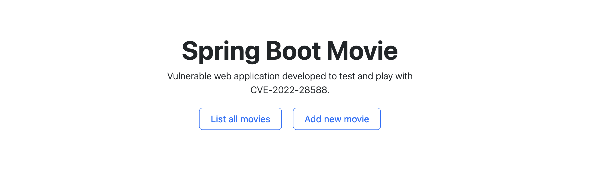

# Spring Boot Movie
[`SpringBootMovie`](https://github.com/lkmc2/SpringBootMovie) is an **open-source Spring Boot web application** that enables users to browse movies, movie's details, watch trailers and keep updated to the latest movie releases.


Currently, it seems that **SpringBootMovie** is not maintained anymore ([latest commit](https://github.com/lkmc2/SpringBootMovie/commit/11444f560bcb4d0ac4f6909019e910b9cc6d8494): March 17th, 2019) and it is affected by two CVEs:

- **CVE-2022-28588**: *in SpringBootMovie <=1.2 when adding movie names, malicious code can be stored because there are no filtering parameters, resulting in stored XSS.*
- **CVE-2022-29001**: *in SpringBootMovie <=1.2, the uploaded file suffix parameter is not filtered, resulting in arbitrary file upload vulnerability.*

In this document, both the CVEs will be considered and analyzed. Moreover, a simplified vulnerable application will be created in order to play and test the vulnerabilities.


## Content
1. [This repository](#this-repository)
2. [TL;DR](#tldr)
3. [The CVEs](#the-cves)
    1. [CVE-2022-28588](#cve-2022-28588)
        1. [Details](#details)
        2. [Stored XSS](#stored-xss)
    2. [CVE-2022-29001](#cve-2022-29001)
        1. [Details](#details-1)
        2. [Arbitrary file upload](#arbitrary-file-upload)
4. [The vulnerable application](#the-vulnerable-application)
    1. [Installing original application](#installing-the-original-application)
    2. [Details of the reproduced application](#details-of-the-reproduces-application)
5. [Run the application](#run-the-application)
6. [Run the exploit](#run-the-exploit)


## This repository
This repository contains the material related to **CVE-2022-28588** and **CVE-2022-29001**. All the material used in the research, development, testing and exploiting of the vulnerabilities, can be found here. In particular, the content of this repository is the following:
- `README.md`: this file. It contains the report in markdown format, with all the information regarding the CVEs, the vulnerable application and the reproduced exploits.
- `Runnable`: it contains the runnable vulnerable application. The application can either start locally (as it is delivered as an executable `.jar`) or as a Docker container (in a already prepared and configured environment). Please refer to the [Run the application](#run-the-application) section for more information.
- `VulnerableApplication`: it contains the source code of the vulnerable application. The application represents a simplified vulnerable version extracted from the [`SpringBootMovie`](https://github.com/lkmc2/SpringBootMovie) application. Please refer to the [The vulnerable application](#the-vulnerable-application) section for more information.
- `Attacker`: it contains the python scripts used as Proof of Concept to exploit the CVE vulnerabilities. More details can be found in the section: [Run the exploit](#run-the-exploit).
- `Images`: it contains the images used in this file.


## TL;DR
We are dealing with two vulnerabilities found in the `MovieAdminController.java` class, which exposes an endpoint to upload the information related to a new movie. In particular:
- a [stored XSS](https://cwe.mitre.org/data/definitions/79.html): the controller does not properly sanitize the user input that will be stored as is in the MySQL database and later rendered by the Thymeleaf engine in the `.html` template containing, now, the malicious code injected;
- an [unrestricted upload of file](https://cwe.mitre.org/data/definitions/434.html): the controller does not properly check the uploaded image file extensions, resulting in an arbitrary file upload. 

To run the vulnerable application, move to [Runnable](./Runnable/) and run the following command: 
```bash
./run-docker.sh
```

This will start the application along with an Apache Tomcat web server listening on `localhost:8080`.

> **NB**: remember to start the docker deamon. 

To run the exploits, move to [Attacker](./Attacker/) and run the following commands:
```bash
pip install -r requirements.txt
python3 exploit.py localhost:8080
```
Select the specific attack to perform and let Python do the job for you. Then, open a browser, connect to `localhost:8080` and hit the `List all movies` button. This will execute the injected codes/files.

## The CVEs
This section contains detailed information and analysis of the considered CVEs: [CVE-2022-28588](https://nvd.nist.gov/vuln/detail/CVE-2022-28588) and [CVE-2022-29001](https://nvd.nist.gov/vuln/detail/CVE-2022-29001).

### CVE-2022-28588
The CVE states that: 

> In SpringBootMovie <=1.2 when adding movie names, malicious code can be stored because there are no filtering parameters, resulting in stored XSS.

#### Details
The CVE refers to a stored XSS that appears in the `MovieAdminController.java` class of the **SpringBootMovie** application: an open-source Spring Boot web application which exposes the `/admin/movie/save` endpoint and which does not properly sanitize the user input. 

Specifically, the application allows admins to inserts new movies information in the database. In order to do so, after the application has started, a page form can be found at `http://localhost:8080/admin` page:


In particular, the form allows admins to insert the following information: 
- `name`;
- `title`;
- `imageFile`: the art of the film which will be displayed (**NB**: this refers to [CVE-2022-29001](#cve-2022-29001));
- `hot`: used to identify trending movies (kind of a *favorite* toggle);
- `content`: the textual description of the movie.

The form logic is embedded in the Thymeleaf `addMovie.html` template and a `<script>` function is defined in order to check that every field of the form has been filled correctly (still, no further controls are implemented to prevent the injection of special tags). Then, the function proceeds to fetch, with `POST` operation the vulnerable endpoint, passing as parameters the inserted information:
```js
<script>
    // 提交表单
    function submitData() {
        // EasyUI无刷新提交
        $('#fm').form('submit', {
            url: '/admin/movie/save',
            onSubmit: function () {
                // 获取内容输入框中的内容
                var content = CKEDITOR.instances.content.getData();

                if (!content) {
                    $.messager.alert('系统提示', '内容输入框中不能为空！');
                    return false;
                }
                // 验证表单字段，如果全通过则提交表单
                return $(this).form('validate');
            },
            success: function (result) {
                var res = eval('(' + result + ')');
                if (res.success) {
                    $.messager.alert('系统提示', '保存成功');
                    resetValue(); // 重置所有输入框的值
                } else {
                    $.messager.alert('系统提示', '保存失败');
                }
            }
        });
    }

    // 重置所有输入框中的值
    function resetValue() {
        $('#name').val('');
        $('#title').val('');
        $('#imageFile').val('');
        $('#no').prop('checked', true);
        CKEDITOR.instances.content.setData('');
    }
</script>
```

The `POST` request analyzed with the developer tools is the following: 


In this case, the payload contains the `name` attribute which has been defined as a malicious JavaScript code `<script>alert(1)</script>`. 

The request gets processed server-side by the `MovieAdminController.java`, which is a `RestController` that manages requests for the `/admin/movie` endpoint:
```java
@RestController
@RequestMapping("admin/movie")
public class MovieAdminController {
    
    /* [...] */
}
```

In particular, the vulnerable function is the following: 
```java 
@PostMapping("/save")
public Map<String, Object> save(
    Movie movie, 
    @RequestParam("imageFile") MultipartFile file,
    HttpServletRequest request) 
    
    throws IOException {

        /* [...] */
    }
```

Which receives the `Movie` directly from the request. The controller proceeds by performing some checks on the uploaded file image: 
```java
if (file != null && !file.isEmpty()) {
    /* [...] */
}
```
updating the publishing date of the movie: 
```java
// 设置发布时间
movie.setPublishDate(new Date());
```
and finally **it saves the movie into the database**: 
```java
// 保存电影到数据库
boolean success = movieService.save(movie);
```
The application is then reloaded: 
```java
// 刷新全局数据
initSystem.loadData(request.getServletContext());
```
and the return value is computed:
```java
Map<String, Object> resultMap = new HashMap<>();
resultMap.put("success", success);
return resultMap;
```

However, the user's input **is never properly sanitized** and the malicious injected JavaScript code is directly inserted in the database and will be rendered by the Thymeleaf template engine as a JavaScript code.

The movie, after the injection, will be displayed correctly: 


But when the page is rendered, the malicious JavaScript code will be executed: 
<center>
    
</center>

Finally, the DOM of the page is the following (here reported only the movie related section, containing the injected code): 


#### Stored XSS
[Stored XSS](https://cwe.mitre.org/data/definitions/79.html) (Cross-Site Scripting) is a type of web application vulnerability that occurs when an attacker **injects malicious code** into a website, which is then **stored and displayed** to other users who access that website. This type of XSS attack typically involves the attacker submitting malicious input, such as script tags or other HTML code, through a form or other input field on the website. When the input is stored on the server and later displayed to other users, the malicious code is executed in the context of the victim's browser, allowing the attacker to steal sensitive information, manipulate content, or perform other malicious actions. Stored XSS attacks can be particularly dangerous because they **can persist over time**, affecting many users who access the affected website.


### CVE-2022-29001

#### Details
#### Arbitrary file upload

## The vulnerable application

The original application vulnerabilities have been extracted and reproduced in a simplified and minimized version in order to facilitate testing and learning. 

### Installing the original application

In order to install and start the original application, you can follow the instruction presented on the GitHub repository of [SpringBootMovie](https://github.com/lkmc2/SpringBootMovie). However, the instructions are reproduced here in a more detailed fashion, in order to facilitate installation and configuration of the required assets.

1. Clone the original repository by running the command:
```bash
git clone https://github.com/lkmc2/SpringBootMovie.git
```
2. Install the MySQL server following the [MySQL installation guide](https://dev.mysql.com/doc/mysql-installation-excerpt/5.7/en/). You will be asked to define the root password.
3. Start the MySQL server by following the instructions in the previous point.
3. Start the MySQL command line client application by running the following command in a shell. You will be prompted to insert the password you define in point 2:
```bash
mysql -u root -p
```
4. Create a new database by running the command:
```bash
CREATE DATABASE spring_boot_movie;
```
5. Connect to the empty database by running the command:
```bash
CONNECT spring_boot_movie;
```
5. Launch the `spring_boot_movie.sql` script (`src/main/resources`) by running the following command. This will execute the `.sql` file containing the initialization of the database, that will be populated with the necessary tables and data in order to run the application. Once the operation is done, we can exit the MySQL client:
```bash
SOURCE spring_boot_movie.sql;
```
6. Install the Redis server following the [Redis installation](https://redis.io/docs/getting-started/installation/) guide. You will be asked to define the password to access the server.
7. Edit the `application.properties` file to include the previously defined password:
```bash
spring.redis.password=<defined_password>
```
8. Start the Redis server by running `redis-server` in a shell.
9. It is now possible to visit `http://localhost:8080/login` in the browser by enter the username `admin` and the password `123456`.

### Details of the reproduces application
The new web application can be found in the [vulnerableApplication](./vulnerableApplication/) directory. 

The technology stack is the following (please note that the stack is slightly different from the original one in order to simplify the set up of the application):
- **Spring Boot** is the framework layer used to automatically configures application components based on classpath and other settings. 
- **H2** is the in-memory database used. While the original application requires to set up a MySQL server and a Redis server, all the database information are now stored in a in-memory H2 database. 
- **Spring Data JPA** is the framework used to interact with the H2 database.
- **Thymeleaf** is the server-side template generator that manages the web HTML pages rendering.
- **Bootstrap v5.3** is used to customize the CSS application properties.

The application presents a simpler UI with respect to the original one, with an index page containing two buttons:
- `List all movies` will render all the movies in the H2 database (and potentially leading to the execution of the stored XSS malicious code);
- `Add new movie` will allow users to create a new movie and insert the information in the H2 database. 



A movie is defined having the following properties (again, slightly different from the original application):
- `title`;
- `director`;
- `description`;
- `overallRating`;
- `publishDate`;
- `imagePathFile`.

The form to input the movie-related information is the following.


Server side, the vulnerable controller is `MovieController.java`, which reproduces the same vulnerable logic of the original component 
```java
@PostMapping("/save")
public Map<String, Object> addMovie(Movie movie, @RequestParam("imageFile") MultipartFile file) throws IOException {

    /* CVE-2022-29001: uploading file without proper sanitization */
    if (file != null && !file.isEmpty()) {
        String fileName = file.getOriginalFilename();
        if (fileName != null) {
            FileUtils.copyInputStreamToFile(file.getInputStream(), new File(imageFilePath + fileName));
            movie.setImageFilePath("upload/static/images/" + fileName);
        }
    }

    /* CVE-2022-28588: saving the movie without proper input sanitization */
    boolean success = movieService.save(movie);

    Map<String, Object> resultMap = new HashMap<>();
    resultMap.put("success", success);
    return resultMap;
}
```

> **NB**: `movieService` is an interface to the Spring Data JPA repository used to interact with the H2 database. In the original application, the `.save(movie)` method refers to a MySQL database operation. As already stated, the use of H2 here has been adopted for simplicity reasons. 

Two notes to take into considerations when comparing the reproduced vulnerable application to the original one. In particular, in the reproduced application:
1. uploaded images are stored in `src/main/resources/upload/static/images` rather than `src/main/resources/static/images`. This is because the `static` folder is loaded into the `target` directory by the spring-boot plugin. If not explicitly configured, context-refresh is not performed and therefore uploaded files could not be found. This is an issue present in the original application. 
2. movie information are displayed directly with the Thymeleaf template engine as **unescaped text**, i.e. `th:utext = "${movie.<property>}"`. This is done in order to reproduce in a simpler fashion the vulnerability in the original application, which uses instead `jQuery` to fetch and display data. Note that `<table>` allows an `url` property which is used by `jQuery` to reach the endpoint, retrieve data and fill the table itself. However, no escaping is automatically performed by the library. 
```html
<table id="dg" title="电影动态信息管理" class="easyui-datagrid"
       fitColumns="true" pagination="true" rownumbers="true"
        url="/admin/movieDetail/list" fit="true" toolbar="#tb">
    <thead>
        <tr>
            <th field="cb" checkbox="true" align="center"></th>
            <th field="id" width="30" align="center">编号</th>
            <th field="movieName" width="100" align="center" formatter="formatMovieName">电影名称</th>
            <th field="websiteName" width="200" align="center" formatter="formatWebsiteName">网站名称</th>
            <th field="info" width="300" align="center">动态信息</th>
            <th field="url" width="200" align="center">具体地址</th>
            <th field="publishDate" width="90" align="center" formatter="formatTime">发布日期</th>
        </tr>
    </thead>
</table>
```

## Run the application
Previous section described the logic of vulnerable application. To start the application, move to the [Runnable](./Runnable/) folder and launch the starting scripts.

The folder contains two files: 

| File | Use |
|:-:|:-:|
| `run-docker.sh` | Build and run a containerized application from the `.jar` target file. The container is prepared such that you should not be required to install Java or other dependencies. |
| `run-local.sh` | Run locally the `vulnerable-application.jar` built from the vulnerable application. Note that this requires Java installed. |

The application will start a HTTP server at `localhost`, port `8080`.

## Run the exploit
This section describes the (simple) python script used as **Proof of Concept** (PoC) to exploit the vulnerability defined in CVE-2022-28588. 

The content of the script can be found in the [Attacker](./Attacker/) folder. For more detailed information, please refer to the `README.md` that you find in that directory.

Before running the script, make sure to have installed all the required modules and packages contained in the `requirements.txt`:
```bash
pip install -r requirements.txt
```

Now, you can start the exploiter with the command: 
```bash
python3 exploit.py <HOST:PORT>
```
