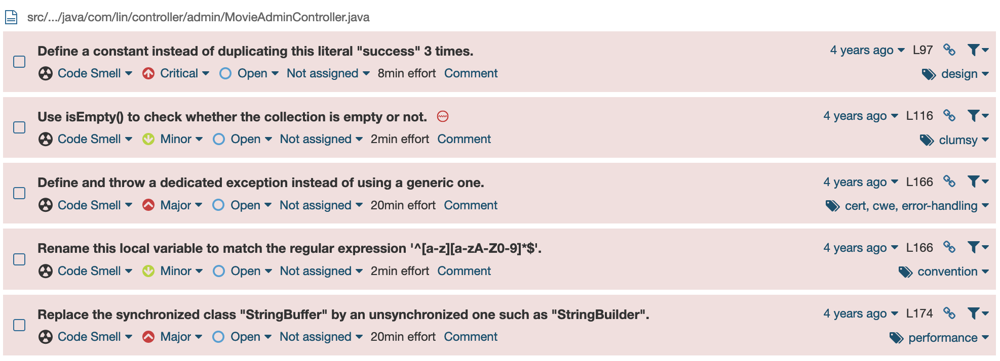

# Spring Boot Movie
[`SpringBootMovie`](https://github.com/lkmc2/SpringBootMovie) is an **open-source Spring Boot web application** that enables users to browse movies, movie's details, watch trailers and keep updated to the latest movie releases.


Currently, it seems that **SpringBootMovie** is not maintained anymore ([latest commit](https://github.com/lkmc2/SpringBootMovie/commit/11444f560bcb4d0ac4f6909019e910b9cc6d8494): March 17th, 2019) and it is affected by two CVEs:

- **CVE-2022-28588**: *in SpringBootMovie <=1.2 when adding movie names, malicious code can be stored because there are no filtering parameters, resulting in stored XSS.*
- **CVE-2022-29001**: *in SpringBootMovie <=1.2, the uploaded file suffix parameter is not filtered, resulting in arbitrary file upload vulnerability.*

In this document, both the CVEs will be considered and analyzed. Moreover, a simplified vulnerable application will be created in order to play and test the vulnerabilities.


## Content
1. [This repository](#this-repository)
2. [Summary](#summary)
3. [The CVEs](#the-cves)
    1. [CVE-2022-28588](#cve-2022-28588)
        1. [Details](#details) 
        2. [Stored XSS](#stored-xss)
        3. [Potential Mitigations](#potential-mitigations)
    2. [CVE-2022-29001](#cve-2022-29001)
        1. [Details](#details-1)
        2. [Arbitrary file upload](#arbitrary-file-upload)
        3. [Potential Mitigations](#potential-mitigations-1)
4. [The vulnerable application](#the-vulnerable-application)
    1. [Installing original application](#installing-the-original-application)
    2. [Static analysis of the original application](#static-analysis-of-the-original-application)
        1. [SpotBugs result](#spotbugs-result)
        2. [SonarQube result](#sonarqube-result)
    3. [Details of the reproduced application](#details-of-the-reproduced-application)
5. [Run the application](#run-the-application)
6. [Run the exploit](#run-the-exploit)


## This repository
This repository contains the material related to **CVE-2022-28588** and **CVE-2022-29001**. All the material used in the research, development, testing and exploiting of the vulnerabilities, can be found here. In particular, the content of this repository is the following:
- `README.md`: this file. It contains the report in markdown format, with all the information regarding the CVEs, the vulnerable application and the reproduced exploits.
- `Runnable`: it contains the runnable vulnerable application. The application can either start locally (as it is delivered as an executable `.jar`) or as a Docker container (in a already prepared and configured environment). Please refer to the [Run the application](#run-the-application) section for more information.
- `VulnerableApplication`: it contains the source code of the vulnerable application. The application represents a simplified vulnerable version extracted from the [`SpringBootMovie`](https://github.com/lkmc2/SpringBootMovie) application. Please refer to the [The vulnerable application](#the-vulnerable-application) section for more information.
- `Attacker`: it contains the python scripts used as Proof of Concept to exploit the CVE vulnerabilities. More details can be found in the section: [Run the exploit](#run-the-exploit).
- `Images`: it contains the images used in this file.
- `Results`: it contains the results of the security vulnerability assessment performed with SpotBugs and SonarQube. More details can be found in the section: [Static analysis of the original application](#static-analysis-of-the-original-application).


## Summary
We are dealing with two vulnerabilities found in the `MovieAdminController.java` class, which exposes an endpoint to upload the information related to a new movie. In particular:
- a [stored XSS](https://cwe.mitre.org/data/definitions/79.html): the controller does not properly sanitize the user input that will be stored as is in the MySQL database and later rendered by the Thymeleaf engine in the `.html` template containing, now, the malicious code injected;
- an [unrestricted upload of file](https://cwe.mitre.org/data/definitions/434.html): the controller does not properly check the uploaded image file extensions, resulting in an arbitrary file upload. 

To run the vulnerable application, move to [Runnable](./Runnable/) and run the following command: 
```bash
./run-docker.sh
```

This will start the application inside the Apache Tomcat web server listening on `localhost:8080`.

> **NB**: remember to start the docker deamon. 

To run the exploits, move to [Attacker](./Attacker/) and run the following commands:
```bash
pip install -r requirements.txt
python3 exploit.py localhost:8080
```
Follow the instruction on the prompt and select a specific attack to perform and let Python do the job for you. Then, open a browser, connect to `localhost:8080` and hit the `List all movies` button. This will execute the injected codes.

## The CVEs
This section contains detailed information and analysis of the considered CVEs: [CVE-2022-28588](https://nvd.nist.gov/vuln/detail/CVE-2022-28588) and [CVE-2022-29001](https://nvd.nist.gov/vuln/detail/CVE-2022-29001).

### CVE-2022-28588
The CVE states that: 

> In SpringBootMovie <=1.2 when adding movie names, malicious code can be stored because there are no filtering parameters, resulting in stored XSS.

The CVSS v3.1 Severity and Metrics information are the following: 
| **CVSS v3.1** | |
|:-:|:-:|
| Base Score | 5.4 Medium |
| Impact Score | 2.7 |
| Exploitability Score | 2.3 |

| **Vector** | |
|:-:|:-:|
| Attack Vector (AV) | Network |
| Attack Complexity (AC) | Low |
| Privileges Required (PR) | Low |
| User Interaction (UI) | Required |
| Scope (S) | Changed |
| Confidentiality (C) | Low |
| Integrity (I) | Low |
| Availability (A) | None |

#### Details
The CVE refers to a stored XSS that appears in the `MovieAdminController.java` class of the **SpringBootMovie** application: an open-source Spring Boot web application which exposes the `/admin/movie/save` endpoint and which does not properly sanitize the user input. 

Specifically, the application allows admins to inserts new movies information in the database. In order to do so, after the application has started, a page form can be found at `http://localhost:8080/admin` page:


In particular, the form allows admins to insert the following information (in the order in which they are displayed in the previous picture): 
- `name`;
- `title`;
- `imageFile`: the art of the film which will be displayed (**NB**: this refers to [CVE-2022-29001](#cve-2022-29001));
- `hot`: used to identify trending movies (kind of a *favorite* toggle);
- `content`: the textual description of the movie.

The form logic is embedded in the Thymeleaf `addMovie.html` template and a `<script>` function is defined in order to check that every field of the form has been filled correctly (still, no further controls are implemented to prevent the injection of special tags). Then, the function proceeds to fetch, with `POST` operation the vulnerable endpoint, passing as parameters the inserted information:
```js
<script>
    // 提交表单
    function submitData() {
        // EasyUI无刷新提交
        $('#fm').form('submit', {
            url: '/admin/movie/save',
            onSubmit: function () {
                // 获取内容输入框中的内容
                var content = CKEDITOR.instances.content.getData();

                if (!content) {
                    $.messager.alert('系统提示', '内容输入框中不能为空！');
                    return false;
                }
                // 验证表单字段，如果全通过则提交表单
                return $(this).form('validate');
            },
            success: function (result) {
                var res = eval('(' + result + ')');
                if (res.success) {
                    $.messager.alert('系统提示', '保存成功');
                    resetValue(); // 重置所有输入框的值
                } else {
                    $.messager.alert('系统提示', '保存失败');
                }
            }
        });
    }

    // 重置所有输入框中的值
    function resetValue() {
        $('#name').val('');
        $('#title').val('');
        $('#imageFile').val('');
        $('#no').prop('checked', true);
        CKEDITOR.instances.content.setData('');
    }
</script>
```

The `POST` request analyzed with the developer tools is the following: 


In this case, the payload contains the `name` attribute which has been defined as a malicious JavaScript code `<script>alert(1)</script>`. 

The request gets processed server-side by the `MovieAdminController.java`, which is a `RestController` that manages requests for the `/admin/movie` endpoint:
```java
@RestController
@RequestMapping("admin/movie")
public class MovieAdminController {
    
    /* [...] */
}
```

In particular, the vulnerable function is the following: 
```java 
@PostMapping("/save")
public Map<String, Object> save(
    Movie movie, 
    @RequestParam("imageFile") MultipartFile file,
    HttpServletRequest request) 
    
    throws IOException {

        /* [...] */
    }
```

Which receives the `Movie` directly from the request. The controller proceeds by performing some checks on the uploaded file image (see: [CVE-2022-29001](#cve-2022-29001)): 
```java
if (file != null && !file.isEmpty()) {
    /* [...] */
}
```
updating the publishing date of the movie: 
```java
// 设置发布时间
movie.setPublishDate(new Date());
```
and finally **it saves the movie into the database**: 
```java
// 保存电影到数据库
boolean success = movieService.save(movie);
```
The application is then reloaded: 
```java
// 刷新全局数据
initSystem.loadData(request.getServletContext());
```
and the return value is computed:
```java
Map<String, Object> resultMap = new HashMap<>();
resultMap.put("success", success);
return resultMap;
```

However, the user's input **is never properly sanitized** and the malicious injected JavaScript code is directly inserted in the database and will be rendered by the Thymeleaf template engine as a JavaScript code.

The movie, after the injection, will be displayed correctly: 


But when the page is rendered, the malicious JavaScript code will be executed: 
<center>
    
</center>

Finally, the DOM of the page is the following (here reported only the movie related section, containing the injected code): 


#### Stored XSS
[Stored XSS](https://cwe.mitre.org/data/definitions/79.html) (Cross-Site Scripting) is a type of web application vulnerability that occurs when an attacker **injects malicious code** into a website, which is then **stored and displayed** to other users who access that website. This type of XSS attack typically involves the attacker submitting malicious input, such as script tags or other HTML code, through a form or other input field on the website. When the input is stored on the server and later displayed to other users, the malicious code is executed in the context of the victim's browser, allowing the attacker to steal sensitive information, manipulate content, or perform other malicious actions. Stored XSS attacks can be particularly dangerous because they **can persist over time**, affecting many users who access the affected website.

#### Potential Mitigations

In order to avoid stored XSS injections, several mitigations can be implemented in the original application: 
- *understand the context in which your data will be used and the encoding that will be expected*: since we know that movie's detail inserted by the user will be embedded in the HTML pages displayed on the website to everybody, it is important to properly sanitize the input of the users. **Escaping spacial characters** inserted, such as `<`, `/` or `.`, will prevent the Thymeleaf engine to embed valid HTML syntax into its own templates. 
- *for any security checks that are performed on the client side, ensure that these checks are duplicated on the server side*: the simple form the retrieves the movie's details perform no sanitization of the input. One would think this is fine as long as the checks are performed server-side. This is not the case either for the considered application, nor as a general rule.
- *assume all input is malicious*: use an "accept known good" input validation strategy, i.e., use a list of acceptable inputs that strictly conform to specifications. Reject any input that does not strictly conform to specifications, or transform it into something that does. 

In the case of the considered application, we can use, **client-side** the [**DOMPurify**](https://github.com/cure53/DOMPurify) library, which is a popular library for sanitizing HTML and preventing cross-site scripting (XSS) attacks. In this case, the client script performing the POST request will retrieve the parameters in the following manner: 

```javascript
const title = DOMPurify.sanitize(document.getElementById("title").value);
const director = DOMPurify.sanitize(document.getElementById("director").value);
const description = DOMPurify.sanitize(document.getElementById("description").value);
const overallRating = DOMPurify.sanitize(document.getElementById("overallRating").value);
const publishDate = DOMPurify.sanitize(document.getElementById("publishDate").value);
const imageFile = document.getElementById("formFile").files[0];
```

On the other hand, to properly check for malicious user input in the server-side controller, we can use the [**OWASP Java Encoder**](https://github.com/OWASP/owasp-java-encoder) library. In particular, after properly importing the necessary library: 

```java
import org.owasp.encoder.Encode;
``` 

and before storing the movie to the database, we can parse the movie's details inserted by the user in the following manner:

```java
movie.setTitle(Encode.forHtml(movie.getTitle()));
movie.setDirector(Encode.forHtml(movie.getDirector()));
movie.setDescription(Encode.forHtml(movie.getDescription()));
movie.setOverallRating(Encode.forHtml(movie.getOverallRating()));
movie.setPublishDate(Encode.forHtml(movie.getPublishDate()));
boolean success = movieService.save(movie);
```

This will prevent an attacker to insert any malicious HTML script in our database.

### CVE-2022-29001
The CVE states that: 

> In SpringBootMovie <=1.2, the uploaded file suffix parameter is not filtered, resulting in arbitrary file upload vulnerability.

The CVSS v3.1 Severity and Metrics information are the following: 
| **CVSS v3.1** | |
|:-:|:-:|
| Base Score | 7.22 High |
| Impact Score | 5.9 |
| Exploitability Score | 1.2 |

| **Vector** | |
|:-:|:-:|
| Attack Vector (AV) | Network |
| Attack Complexity (AC) | Low |
| Privileges Required (PR) | High |
| User Interaction (UI) | None |
| Scope (S) | Unchanged |
| Confidentiality (C) | High |
| Integrity (I) | High |
| Availability (A) | High |

#### Details
The CVE refers to to an **arbitrary file upload** that appears in the `MovieAdminController.java` class of the **SpringBootMovie** application (the same function of the previous analyzed CVE): an open-source Spring Boot web application which exposes the `/admin/movie/save` endpoint and which does not properly sanitize the user input. 

Specifically, the application allows admins to upload the movie art image along with the other movie information. In order to do so, after the application has started, a page form can be found at `http://localhost:8080/admin` page:


The uploaded image file is posted server-side as a MultipartFile object, which is retrieved by the vulnerable function previously analyzed. Differently from the stored XSS vulnerability, in this case it is the file extension that is not properly sanitized. The function is the following: 

```java
if (file != null && !file.isEmpty()) {
    // 获取文件名
    String fileName = file.getOriginalFilename();
    // 获取文件后缀名
    if (fileName != null) {
        String suffixName = fileName.substring(fileName.lastIndexOf("."));
        String newFileName = DateUtils.getCurrentDateStr() + suffixName;
        // 保存图片到本地服务器
        FileUtils.copyInputStreamToFile(file.getInputStream(), new File(imageFilePath + newFileName));
        // 设置电影的图片名
        movie.setImageName(newFileName);
    }
}
```

In particular, the provided snippet of code simply checks the following requirements:
- the file exists;
- the file is not empty;
- the file has, indeed, a name;

The **suffix extension of the file is directly appended to the new filename** that is used to identify the file in the server directory: 
```java
String suffixName = fileName.substring(fileName.lastIndexOf("."));
String newFileName = DateUtils.getCurrentDateStr() + suffixName;
```

This leads to the unrestricted possibility of uploading every kind of file, without checking that the file is an actual image. However, the original application has been thoroughly tested in according to the original opened [issue](https://github.com/lkmc2/SpringBootMovie/issues/4), and the upload of `.php` files do not lead to any particular execution.

As I stated in [this](https://github.com/lkmc2/SpringBootMovie/issues/4#issuecomment-1458518815) comment: 
> It appears to me that, while uploading a `.php` file works fine (as the CVE is indeed an arbitrary file upload vulnerability), the file cannot be executed by the `Apache Tomcat/9.0.16` Web Engine, which does not natively support PHP execution (as it requires a third-party plugin or a bridge like Apache Tomcat Connectors).

While PHP files cannot be natively executed on the web server booted by Spring Boot, the vulnerability persists and several actions can be performed. As an example, an attacker may still be able to use the uploaded PHP file as part of a larger attack chain or, also, he can upload huge files, leading to file space denial of services.

#### Arbitrary file upload
[Unrestricted Upload of File with Dangerous Type](https://cwe.mitre.org/data/definitions/434.html) is a security vulnerability that can compromise the integrity and security of computer systems or applications. This vulnerability arises when users are allowed to upload files without any restrictions on the file type or content, which may include files containing malicious code or other dangerous content. Attackers can exploit this vulnerability by uploading files that contain viruses, malware, or other forms of malicious code, which can then be executed on the system, compromising its security and potentially leading to sensitive data theft, system damage, or other harmful outcomes.

#### Potential Mitigations
To avoid having unrestricted file upload on the application, several mitigations can be implemented: 
- generate a new, unique filename for an uploaded file instead of using the user-supplied filename, so that no external input is used at all. In the original application, the original file name was discarded (which is fine) but the original suffix was used (why? really, why?).
- consider storing the uploaded files outside of the web document root entirely. Then, use other mechanisms to deliver the files dynamically. In the original application, the file is stored directly in the static content, which is loaded ad boot-up directly by Spring Boot (again, not good...).
- define a very limited set of allowable extensions and only generate filenames that end in these extensions.
- for any security checks that are performed on the client side, ensure that these checks are duplicated on the server side. As previously stated, redundance of checks cause no harms.
- assume all input is malicious. Use an "accept known good" input validation strategy, i.e., use a list of acceptable inputs that strictly conform to specifications.
- do not rely exclusively on sanity checks of file contents to ensure that the file is of the expected type and size. It is possible for an attacker to spoof the content or the name of the file, tricking the server into allowing it. 

In the case of the considered application, we can perform the following checks on the client-side form in order to prevent unrestricted file upload:
1. check if the input field is not empty:
```javascript
if (!document.getElementById("formFile").value) {
    // handle error
}
```
2. check the file extension to ensure that it is a valid image file. For example, to restrict uploads to JPEG, PNG, and GIF files:
```javascript
const allowedExtensions = ["jpg", "jpeg", "png", "gif"];
const fileExtension = imageFile.name.split(".").pop().toLowerCase();
if (!allowedExtensions.includes(fileExtension)) {
    // handle error
}
```
3. Check the file size to ensure that it is within the allowed limit:
```javascript
const maxSize = 1048576; // 1MB
if (imageFile.size > maxSize) {
    // handle error
}
```
4. Check the MIME type to ensure that it is a valid image file:
```javascript
const allowedMimeTypes = ["image/jpeg", "image/png", "image/gif"];
if (!allowedMimeTypes.includes(imageFile.type)) {
    // handle error
}
```

As previously stated, it is important to replicate the checks server-side. As an example, we could check that the file type is one among the allowed ones:
```java
contentType.equals("image/jpeg") || contentType.equals("image/png") || ...
```

and we can generate the filename as: 
```java
UUID.randomUUID().toString()
```

Although, in the original application, a `Date()` object is used which should cause no harm.


## The vulnerable application

The original application vulnerabilities have been extracted and reproduced in a simplified and minimized version in order to facilitate testing and learning. 

### Installing the original application

In order to install and start the original application, you can follow the instruction presented on the GitHub repository of [SpringBootMovie](https://github.com/lkmc2/SpringBootMovie). However, the instructions are reproduced here in a more detailed fashion, in order to facilitate installation and configuration of the required assets.

1. Clone the original repository by running the command:
```bash
git clone https://github.com/lkmc2/SpringBootMovie.git
```
2. Install the MySQL server following the [MySQL installation guide](https://dev.mysql.com/doc/mysql-installation-excerpt/5.7/en/). You will be asked to define the root password.
3. Start the MySQL server by following the instructions in the previous point.
3. Start the MySQL command line client application by running the following command in a shell. You will be prompted to insert the password you define in point 2:
```bash
mysql -u root -p
```
4. Create a new database by running the command:
```bash
CREATE DATABASE spring_boot_movie;
```
5. Connect to the empty database by running the command:
```bash
CONNECT spring_boot_movie;
```
5. Launch the `spring_boot_movie.sql` script (`src/main/resources`) by running the following command. This will execute the `.sql` file containing the initialization of the database, that will be populated with the necessary tables and data in order to run the application. Once the operation is done, we can exit the MySQL client:
```bash
SOURCE spring_boot_movie.sql;
```
6. Install the Redis server following the [Redis installation](https://redis.io/docs/getting-started/installation/) guide. You will be asked to define the password to access the server.
7. Edit the `application.properties` file to include the previously defined password:
```bash
spring.redis.password=<defined_password>
```
8. Start the Redis server by running `redis-server` in a shell.
9. It is now possible to visit `http://localhost:8080/admin` in the browser by enter the username `admin` and the password `123456`.

### Static analysis of the original application
In this section, we will focus on the **static analysis** of the original application, specifically using **SpotBugs** and **SonarQube** to assess security vulnerabilities. Static analysis is a software testing technique that involves analyzing the code without actually executing it. By doing so, we can identify potential security issues early in the development process, before the application is deployed. In the following sections, we will discuss the results of the security assessment using SpotBugs and SonarQube and provide recommendations on how to address the identified vulnerabilities.

> **NB**: free Community Edition of SonarQube has been used to perform the analysis. In this version of the software, a lot of features are missing and therefore the result is missing the specific CVEs addressed in this report.

#### SpotBugs result
The [FindSecBugs](https://github.com/find-sec-bugs/find-sec-bugs/wiki/IntelliJ-Tutorial) plugin has been used to scan the original project. The configuration of the performances of SpotBugs is the following: 
- *Analysis effort*: `maximal`
- *Minimum confidence*: `low`

> **NB**: a complete and detailed report of the analysis performed by SpotBugs can be found in `Results` as [`spotbugs.html`](./Results/spotbugs.html).

In particular, the following results are of great interest for this report:

- **Hard coded password**: the admin password is hard coded in the `WebSecurityConfig` (`com.lin.config`) class at line 47: 
    ```java
    .password("123456")
    ```
    This leads to the effectiveness of the CVEs, which require admin authentication in order to be exploited. 
    
    From SpotBugs: 

    > Passwords should not be kept in the source code. The source code can be widely shared in an enterprise environment, and is certainly shared in open source. To be managed safely, passwords and secret keys should be stored in separate configuration files or keystores. (Hard coded keys are reported separately by Hard Coded Key pattern).

- **Potential path traversal**: this is a false positive detected by SpotBugs in the considered vulnerable endpoint `/admin/movie/save`. In particular, SpotBugs suggest that `FileUtils.copyInputStreamToFile(file.getInputStream(), new File(imageFilePath + newFileName));` performs the opening of a file whose name derives from the input parameter. However, as previously stated, the new filename of the file is generated by the `DateUtils.getCurrentDateStr()` and only the suffix name of the file is used. 

    From SpotBugs:

    > A file is opened to read its content. The filename comes from an input parameter. If an unfiltered parameter is passed to this file API, files from an arbitrary filesystem location could be read.
    This rule identifies potential path traversal vulnerabilities. In many cases, the constructed file path cannot be controlled by the user. If that is the case, the reported instance is a false positive.

- **MovieAdminController is a Spring endpoint (Controller)**: SpotBugs detects that this class is a controller that exposes endpoints reachable remotely. All the methods annotated with `@RequestMapping` should be checked. Although it does not detects possible stored XSS injection coming from the non-sanitized input, it detects that this endpoint may be exploited by malicious users if not properly audited and configured. 

    From SpotBugs: 

    > This class is a Spring Controller. All methods annotated with RequestMapping (as well as its shortcut annotations GetMapping, PostMapping, PutMapping, DeleteMapping, and PatchMapping) are reachable remotely. This class should be analyzed to make sure that remotely exposed methods are safe to expose to potential attackers.


#### SonarQube result

On the other hand, SonarQube Free Community Edition was not capable of detecting the specific CVEs addressed in this report. The following is the result of SonarQube analysis:


In particular, the analysis reports:
- no bugs found;
- no vulnerabilities found;
- 29 code smells;
- 3 security hot-spot.

The following are the code smells related to the Controller Class considered in the CVEs, although they do not refer to any specific problems:



The security hot-spot refers to possible **Cross-Site Request Forgery** (**CSRF**) in the considered controller:


<center>
    
</center>

In particular, from SonarQube:

> An HTTP method is **safe** when used to perform a read-only operation, such as retrieving information. In contrast, an **unsafe HTTP method** is used to change the state of an application, for instance to update a user’s profile on a web application. Common safe HTTP methods are `GET`, `HEAD`, or `OPTIONS`. Common unsafe HTTP methods are `POST`, `PUT` and `DELETE`. Allowing both safe and unsafe HTTP methods to perform a specific operation on a web application could impact its security, for example CSRF protections are most of the time only protecting operations performed by unsafe HTTP methods.

This happens because the `@RequestMapping()` annotation in the specific endpoint handler does not specify which verb the user will be required to use, allowing every possible requests to the specific endpoint. A possible mitigation to this issue could be to use a more specific annotation, such as: `@PostMapping()` or `@GetMapping()`.

However, all the endpoints that raised a security hot-spot does not contain any of the vulnerabilities contained in the analyzed CVEs.


### Details of the reproduced application
The new web application can be found in the [vulnerableApplication](./vulnerableApplication/) directory. 

The technology stack is the following (please note that the stack is slightly different from the original one in order to simplify the set up of the application itself):
- **Spring Boot** is the framework layer used to automatically configures application components based on classpath and other settings. 
- **H2** is the in-memory database used. While the original application requires to set up a MySQL server and a Redis server, all the database information are now stored in a in-memory H2 database. 
- **Spring Data JPA** is the framework used to interact with the H2 database.
- **Thymeleaf** is the server-side template generator that manages the web HTML pages rendering.
- **Bootstrap v5.3** is used to customize the CSS application properties.

The application presents a simpler UI with respect to the original one, with an index page containing two buttons:
- `List all movies` will render all the movies in the H2 database (and potentially leading to the execution of the stored XSS malicious code);
- `Add new movie` will allow users to create a new movie and insert the information in the H2 database. 


A movie is defined having the following properties (again, slightly different from the original application, but with no effect on the vulnerabilities):
- `title`;
- `director`;
- `description`;
- `overallRating`;
- `publishDate`;
- `imagePathFile`.

The form to input the movie-related information is the following.


As the original application, the form defines a simple script to POST request the server with the movie information that will binding the `Movie` object. The script is the following: 

```javascript
<script>
    const save = async () => {

        // Gather form data
        const title = document.getElementById("title").value;
        const director = document.getElementById("director").value;
        const description = document.getElementById("description").value;
        const overallRating = document.getElementById("overallRating").value;
        const publishDate = document.getElementById("publishDate").value;
        const imageFile = document.getElementById("formFile").files[0];

        const formData = new FormData();
        formData.append("title", title);
        formData.append("director", director);
        formData.append("description", description);
        formData.append("overallRating", overallRating);
        formData.append("publishDate", publishDate);
        formData.append("imageFile", imageFile);

        // Send POST request
        try {
            await fetch('/save', {
                method: 'POST',
                body: formData
            });
            window.location.href='http://localhost:8080'
        } catch (error) {
            console.log(error);
        }
    }
</script>
```

Server side, the vulnerable controller is `MovieController.java`, which reproduces the same vulnerable logic of the original component 
```java
@PostMapping("/save")
public Map<String, Object> addMovie(Movie movie, @RequestParam("imageFile") MultipartFile file) throws IOException {

    /* CVE-2022-29001: uploading file without proper sanitization */
    if (file != null && !file.isEmpty()) {
        String fileName = file.getOriginalFilename();
        if (fileName != null) {
            FileUtils.copyInputStreamToFile(file.getInputStream(), new File(imageFilePath + fileName));
            movie.setImageFilePath("upload/static/images/" + fileName);
        }
    }

    /* CVE-2022-28588: saving the movie without proper input sanitization */
    boolean success = movieService.save(movie);

    Map<String, Object> resultMap = new HashMap<>();
    resultMap.put("success", success);
    return resultMap;
}
```

> **NB**: `movieService` is an interface to the Spring Data JPA repository used to interact with the H2 database. In the original application, the `.save(movie)` method refers to a MySQL database operation. As already stated, the use of H2 here has been adopted for simplicity reasons. 

Two notes to take into considerations when comparing the reproduced vulnerable application to the original one. In particular, in the reproduced application:
1. uploaded images are stored in `src/main/resources/upload/static/images` rather than `src/main/resources/static/images`. This is because the `static` folder is loaded into the `target` directory by the spring-boot plugin. If not explicitly configured, context-refresh is not performed and therefore uploaded files could not be found until the next re-boot of the application itself. This is an issue present in the original application. 
2. movie information are displayed directly with the Thymeleaf template engine as **unescaped text**, i.e. `th:utext = "${movie.<property>}"`. This is done in order to reproduce in a simpler fashion the vulnerability in the original application, which instead uses `jQuery` to fetch and display data. Note that `<table>` allows an `url` property which is used by `jQuery` to reach the endpoint, retrieve data and fill the table itself. However, no escaping is automatically performed by the library. 
```html
<table id="dg" title="电影动态信息管理" class="easyui-datagrid"
       fitColumns="true" pagination="true" rownumbers="true"
        url="/admin/movieDetail/list" fit="true" toolbar="#tb">
    <thead>
        <tr>
            <th field="cb" checkbox="true" align="center"></th>
            <th field="id" width="30" align="center">编号</th>
            <th field="movieName" width="100" align="center" formatter="formatMovieName">电影名称</th>
            <th field="websiteName" width="200" align="center" formatter="formatWebsiteName">网站名称</th>
            <th field="info" width="300" align="center">动态信息</th>
            <th field="url" width="200" align="center">具体地址</th>
            <th field="publishDate" width="90" align="center" formatter="formatTime">发布日期</th>
        </tr>
    </thead>
</table>
```

## Run the application
Previous section described the logic of vulnerable application. To start the application, move to the [Runnable](./Runnable/) folder and launch the starting scripts.

The folder contains two files: 

| File | Use |
|:-:|:-:|
| `run-docker.sh` | Build and run a containerized application from the `.jar` target file. The container is prepared such that you should not be required to install Java or other dependencies. |
| `run-local.sh` | Run locally the `vulnerable-application.jar` built from the vulnerable application. Note that this requires Java 17 installed. |

The application will start a Apache Tomcat/10.1.5 HTTP web server at `localhost`, port `8080`.

## Run the exploit
This section describes the (simple) python script used as **Proof of Concept** (PoC) to exploit the vulnerability defined in CVE-2022-28588. 

The content of the script can be found in the [Attacker](./Attacker/) folder. For more detailed information, please refer to the `README.md` that you find in that directory.

Before running the script, make sure to have installed all the required modules and packages contained in the `requirements.txt`:
```bash
pip install -r requirements.txt
```

Now, you can start the exploiter with the command: 
```bash
python3 exploit.py <HOST:PORT>
```
